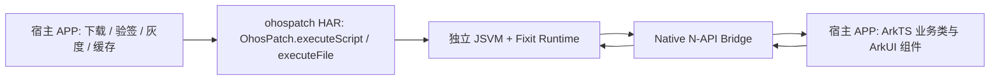
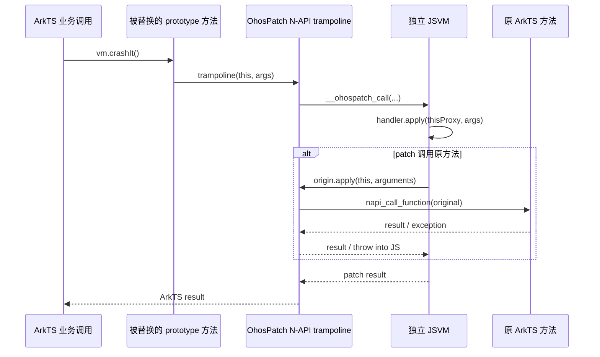
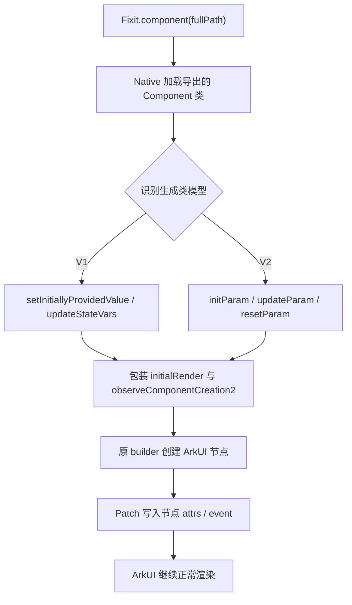
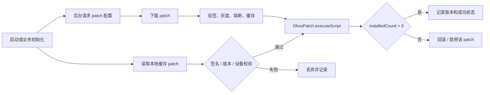
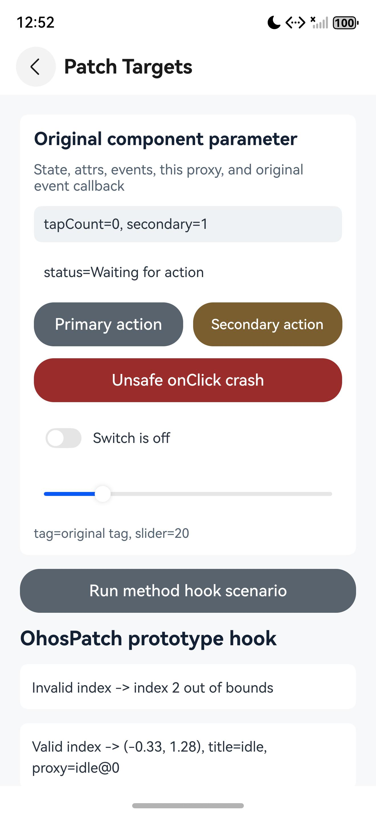
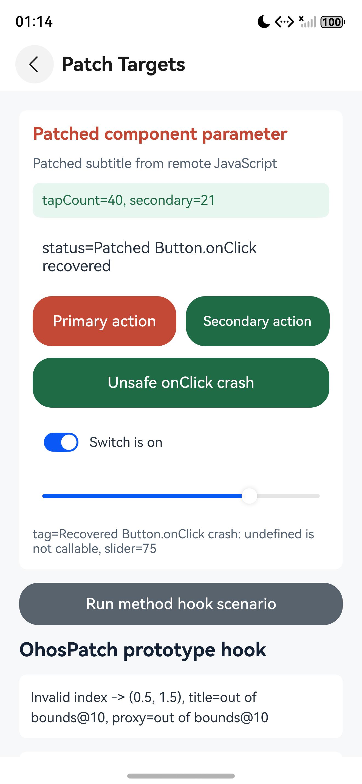

# OhosPatch

OhosPatch 是面向 HarmonyOS/OpenHarmony 的 ArkTS 运行时热修复框架，灵感来自 iOS 的 [FIXiT](https://github.com/rickytan/FIXiT)。它把补丁脚本放在独立 JSVM 中执行，再通过 Native N-API 在 ArkTS 主 VM 中加载目标模块、替换类原型方法和声明式组件渲染入口。

项目当前不是概念验证原型，而是一套可以按生产流程接入的 HAR 能力：宿主 APP 负责下载、验签、灰度、缓存和回滚，OhosPatch 只负责在运行时安装和清理 patch。业务类和业务组件不需要继承基类、加装饰器、注册类表或调用补丁分发 API。

## 背景

HarmonyOS 上的 ArkTS 应用发布后，常见问题包括：

- 线上业务方法抛异常，例如 `undefined is not a function`、数组越界、空值访问。
- 声明式组件参数、状态、属性或事件回调存在错误。
- 已发布版本需要小范围止血，但重新发版和审核周期过长。

在 iOS 上，FIXiT 可以依赖 JavaScriptCore 和 Objective-C runtime 动态替换方法。HarmonyOS 的情况不同：目前公开平台能力中没有一套面向 ArkTS 方法和 ArkUI 声明式组件的通用原生热修复方案，也没有类似 Objective-C runtime 的公开方法交换入口。OhosPatch 的目标是在不侵入业务代码的前提下，为 ArkTS 提供可控、可回滚、可观测的运行时 patch 能力。

## 能力概览

- 以 HAR 形式接入，产物是 `ohospatch.har`。
- Patch 使用普通 JavaScript 编写，在独立 JSVM 中运行。
- 支持实例方法、静态方法、原方法调用 `origin.apply(...)`。
- Patch handler 中的 `this` 是当前 ArkTS 实例 Proxy，支持点语法读写多层属性和调用方法。
- 支持 `Fixit.import(fullPath)` 动态导入其他 ArkTS 类，调用静态方法、构造实例、访问实例方法和属性。
- 支持声明式 Component DSL：参数、状态、节点属性和同步事件回调。
- 支持 `console` 到 HiLog、`setTimeout`、`setInterval`、`setImmediate`、`queueMicrotask`。
- C++ 层以 `-fno-exceptions` 构建，不抛 C++ 异常；错误走 HiLog 并 fail closed。
- `clear()` 可恢复原方法、清空 JS registry、释放引用并取消 timer。

## 工程结构

```text
OhosPatch/
├── ohospatch/                 # 可复用 HAR 模块，所有 patch 能力都在这里
│   ├── Index.ets              # HAR 对外 API
│   └── src/main/
│       ├── cpp/               # JSVM、N-API、Hook、ArkTS Proxy 桥
│       │   └── runtime/       # 内置 Fixit JS runtime
│       ├── ets/               # ArkTS 外观 API
│       └── module.json5       # 无下载、无验签、无启动任务
├── entry/                     # Demo APP，只负责演示宿主如何接入 HAR
│   └── src/main/ets/
│       ├── demo/              # 未侵入的业务类和组件
│       ├── patch/             # 宿主下载、验签接入点和加载策略
│       └── pages/             # 两级 Navigation Demo 页面
├── patch-server/              # 开发期 HTTP patch 服务
├── skills/ohospatch/          # Codex/Claude patch 编写 Skill
├── scripts/                   # 设备测试和 Skill 安装脚本
└── docs/images/               # README 效果图
```

`ohospatch` 不包含下载、签名验证、版本匹配、灰度、缓存或启动策略。这些都是宿主 APP 的生产发布系统职责。

## 架构



方法 Hook 调用链：



声明式组件 Hook 调用链：



## 原理

iOS FIXiT 同时依赖 JavaScriptCore 和 Objective-C runtime。HarmonyOS 上 `OH_JSVM_CreateVM` 创建的 JSVM 与 ArkTS 主 VM 不共享对象堆和原型链，因此在 JSVM 中直接改 `DemoViewModel.prototype` 不会影响 ArkTS 业务对象。

OhosPatch 使用两层运行时协作：

1. 宿主将已验证的完整 JavaScript 字符串或本地绝对路径传给 HAR。
2. Native 模块创建独立 JSVM，先执行内置 `fixit.js`，再执行宿主 patch。
3. Patch 通过 `Fixit.fix()`、`Fixit.component()` 和 `Fixit.import()` 注册目标。
4. Native 使用 `napi_load_module_with_info` 在 ArkTS 主 VM 加载业务模块。
5. 实例方法替换 `constructor.prototype[methodName]`，静态方法替换 `constructor[methodName]`。
6. 原方法以 `napi_ref` 保存，新方法进入 Native trampoline。
7. JSVM handler 中的 `this` 是调用期 Proxy；属性读取、赋值、方法调用同步桥接到原 ArkTS 对象。
8. `origin.apply(this, arguments)` 通过保存的 `napi_ref` 调回原方法。
9. `clear()` 恢复原函数并释放 Hook、Component、动态导入对象和 timer。

已创建的业务实例也会受影响，因为普通 public 方法调用会经过对象属性和原型查找。构造函数、私有实现、实例字段箭头函数和绕过属性查找的调用点不属于当前覆盖范围。

## 生产接入模型

OhosPatch 在生产环境中只负责“执行已可信 patch”。建议宿主侧按下面流程接入：



宿主必须负责：

- Patch 文件下载和 HTTPS 策略。
- 非对称签名或等价安全校验。
- App 版本、设备、系统版本、业务版本匹配。
- 灰度发布、黑白名单、熔断和回滚。
- Patch 缓存和清理。
- 启动时机、超时控制和日志上报。

HAR 不声明网络权限，也不会把任何下载或签名逻辑放入 `ohospatch` 模块。

## 接入方式

生产项目直接从 OHPM 引入已发布包：

```bash
ohpm install @rickytan/ohospatch
```

宿主模块的 `oh-package.json5` 会得到类似依赖：

```json5
{
  "dependencies": {
    "@rickytan/ohospatch": "^1.0.3"
  }
}
```

本仓库源码 Demo 为了方便本地联调，`entry/oh-package.json5` 仍使用本地模块路径：

```json5
{
  "dependencies": {
    "@rickytan/ohospatch": "file:../ohospatch"
  }
}
```

业务代码不需要任何改动。宿主只在自己的 patch 管理代码里调用：

```ts
import { OhosPatch } from '@rickytan/ohospatch';

OhosPatch.init(context);
const installResult = OhosPatch.executeScript(verifiedPatchScript);
console.info(`OhosPatch installed ${installResult.installedCount} rules`);
```

或者执行已下载到本地的完整文件路径：

```ts
const installResult = OhosPatch.executeFile(absolutePatchPath);
console.info(`OhosPatch installed ${installResult.installedCount} rules`);
```

`init(context)` 建议在宿主 Patch 管理模块或 `StartupTask.init(context)` 中调用一次，用于给 Patch Runtime 绑定宿主 APP 的 `Context`。`executeFile` 只读取绝对路径文件并执行；路径来源、文件权限、验签和缓存策略仍由宿主控制。

清除当前 patch：

```ts
OhosPatch.clear();
```

`executeScript` / `executeFile` 返回 `PatchInstallResult`，当前包含 `installedCount: number`，表示本次已安装的普通方法 hook 和 Component rule 数量。后续版本会在这个结构中扩展更多安装诊断信息。Component rule 主要在后续渲染阶段生效，生产侧不应只用安装数量判断业务效果，建议同时记录 patch 版本和运行时日志。

## Patch 编写

Patch 脚本可以引用声明文件获得 IDE 补全：

```js
/// <reference path="./fixit.d.js" />
```

完整目标路径格式是：

```text
bundleName/moduleName/[packagePath/]src/main/ets/File#ExportName
@package/name/src/main/ets/File#ExportName
/src/main/ets/File#ExportName
```

Runtime 解析路径时以 `src/main/ets` 为锚点。完整路径里前两段是 `bundleName/moduleName`，锚点前剩余的所有段都会作为 OH package path：

```text
com.example.app/entry/@google/somelib/src/main/ets/foo/Bar#Bar
```

上面会解析为 `moduleInfo = com.example.app/entry`，`modulePath = @google/somelib/src/main/ets/foo/Bar`。

`#ExportName` 必须对应 ArkTS 文件中实际 `export` 出来的类、函数或自定义 Component。OhosPatch 通过 `napi_load_module_with_info` 加载模块后只能从模块导出对象上取值；没有 `export` 的内部类型、文件内局部类、未导出的 `@Entry` 页面或只在文件内部使用的 helper，运行时无法定位，也就不能作为 `Fixit.fix()`、`Fixit.component()` 或 `Fixit.import()` 的目标。需要被 patch 的业务类或 Component 应保持稳定导出名，并在开启混淆时为这些导出和需要 hook 的方法配置 keep 规则。

如果目标在当前运行的 APP/module 中，可以省略 `bundleName/moduleName`。`@` 开头表示当前 host module 下的 OH package path；`/` 开头表示当前 host module 自己的源码路径。host 信息来自 `OhosPatch.init(context)`：

```text
@vendor/business_page/src/main/ets/components/PatchablePanel#PatchablePanel
/src/main/ets/pages/Index#Index
```

例如 Demo 的 `PatchablePanel` 来自 `@vendor/business_page` 包，因此推荐写法为：

```text
@vendor/business_page/src/main/ets/components/PatchablePanel#PatchablePanel
```

下面每个示例都先列出已经发布在 APP 中、无需为 OhosPatch 修改的原始 ArkTS 代码，再列出下发的 JavaScript Patch。

### 修复实例方法

原始 ArkTS 类：

```ts
export class DemoViewModel {
  buttonTitle: string = 'idle';
  profile: DemoProfile = new DemoProfile();

  locationOf(locations: Array<Point>, index: number, _defaultValue: Point): Point {
    const point = locations[index];
    if (point === undefined) {
      throw new Error(`index ${index} out of bounds`);
    }
    return point;
  }
}
```

对应 Patch：

```js
var fix = Fixit.fix( // 返回 FixBuilder，用来继续声明当前类上的方法 patch。
  'com.example.app/entry/src/main/ets/model/DemoViewModel#DemoViewModel' // 完整目标路径：bundle/module/file#export。
);

var originLocation = fix.instanceMethod( // 返回 OriginMethod，可在 handler 中调用原实例方法。
  'locationOf', // 要替换的实例方法名，等价于 DemoViewModel.prototype.locationOf。
  function (locations, index, fallback) { // 返回值必须与原 ArkTS 方法兼容：这里是 Point。
    if (index < 0 || index >= locations.length) { // 在 JSVM 中先做越界保护，避免原方法抛异常。
      this.profile.badge.text = 'out of bounds'; // this 是当前 DemoViewModel 实例 Proxy；这里写多层属性。
      this.profile.badge.advance(10); // 调用嵌套 ArkTS 对象上的实例方法，返回值按 JSON/Proxy 规则桥接。
      this.buttonTitle = this.profile.summary(); // 调用 ArkTS 方法并把 string 结果写回原实例字段。
      return fallback; // 返回 Point；调用方看到的是替代后的安全结果。
    }
    return originLocation.apply(this, arguments); // 返回 Point；用原 this 和全部原参数调用 ArkTS 原方法。
  }
);
```

`this` 是当前 `DemoViewModel` 实例的同步 Proxy，可以用普通点语法访问多层属性、赋值和调用实例方法。越界时 Patch 返回 `fallback`；未越界时，`originLocation.apply(this, arguments)` 把原接收者和全部原参数交还给原方法。

### 修复 `undefined is not a function`

原始 ArkTS 组件中的第三个 Button：

```ts
@Component
export struct PatchablePanel {
  @State statusText: string = 'Waiting for action';
  @State tagText: string = 'original tag';
  unsafeCallback?: () => string;

  build() {
    Column() {
      // occurrence 0: Primary action
      Button('Primary action').onClick(() => {})
      // occurrence 1: Secondary action
      Button('Secondary action').onClick(() => {})
      // occurrence 2: Unsafe onClick crash
      Button('Unsafe onClick crash')
        .onClick(() => {
          this.tagText = (this.unsafeCallback as () => string)();
        })
    }
  }
}
```

`unsafeCallback` 没有赋值，原 `Button.onClick` 会触发 `undefined is not a function`。对应 Patch 选择第三个 Button，替换其回调，并在 `try` 中调用原回调：

```js
var panel = Fixit.component( // 返回 ComponentBuilder，用来声明组件参数、状态、节点和事件 patch。
  'com.example.app/entry/src/main/ets/components/PatchablePanel#PatchablePanel' // 完整目标路径：bundle/module/file#export。
);

var originUnsafeClick = panel.node({ type: 'Button', occurrence: 2 }) // 返回 NodeBuilder；选择当前组件内第三个 Button。
  .event('onClick', function () { // 返回 OriginEvent；handler 返回值作为新的 onClick 返回值，通常是 undefined/void。
    try { // try/catch 必须包住 origin.apply，才能捕获原 ArkTS 回调抛出的异常。
      return originUnsafeClick.apply(this, arguments); // 返回原 onClick 的返回值；onClick 通常是 void/undefined。
    } catch (err) { // err 是 JS Error 或可字符串化对象。
      var message = err && err.message ? err.message : String(err); // 返回 string，用于展示错误信息。
      this.tagText = 'Recovered Button.onClick crash: ' + message; // this 是当前组件实例 Proxy；写 @State。
      this.statusText = 'Patched Button.onClick recovered'; // 写另一个 @State，让 UI 后续刷新显示恢复结果。
      return undefined; // 明确返回 void，表示已吞掉原 crash。
    }
  });
```

OhosPatch 在 `origin.apply(...)` 边界把原 ArkTS pending exception 转成当前 JSVM 调用中可捕获的 `Error`。这个 `try/catch` 必须包住 `originUnsafeClick.apply(...)`；只包 Patch 自己的状态赋值无法捕获原回调异常。handler 不处理异常时，Runtime fail closed，保留原业务异常行为。

### 修复静态方法并导入其他类

原始 ArkTS 类：

```ts
export class Point {
  readonly x: number;
  readonly y: number;

  constructor(x: number, y: number) {
    this.x = x;
    this.y = y;
  }

  toText(): string { return `(${this.x}, ${this.y})`; }
  static textOf(point: Point): string { return `(${point.x}, ${point.y})`; }
}

export class DemoViewModel {
  static crash(): string {
    throw new Error('class crash');
  }
}
```

对应 Patch：

```js
var Point = Fixit.import( // 返回 ArkTS 类 Proxy，可 new，也可调用静态方法。
  'com.example.app/entry/src/main/ets/model/Point#Point' // 完整目标路径：bundle/module/file#export。
);
var fix = Fixit.fix( // 返回 FixBuilder，用来声明 DemoViewModel 上的方法 patch。
  'com.example.app/entry/src/main/ets/model/DemoViewModel#DemoViewModel'
);

fix.classMethod('crash', function () { // 返回 OriginMethod；这里未保存，因为 patch 不需要调用原静态方法。
  var point = new Point(7, 9); // 返回 ArkTS Point 实例 Proxy。
  return Point.textOf(point) + ' / ' + point.toText(); // 返回 string，必须与原 static crash(): string 兼容。
});
```

`Fixit.import()` 返回可调用的持久 ArkTS 类 Proxy，支持静态方法、`new`、实例属性和实例方法。`require(fullPath)` 是它的别名。

### 修复 Component 参数和状态

原始状态管理 V1 组件：

```ts
@Component
export struct PatchablePanel {
  @Prop message: string = 'Original component parameter';
  @Prop subtitle: string = 'Original subtitle';
  @State tapCount: number = 0;
  @State statusText: string = 'Waiting for action';

  build() {
    Column() {
      Text(this.message)
      Text(this.subtitle)
      Text(`tapCount=${this.tapCount}`)
      Text(`status=${this.statusText}`)
    }
  }
}
```

对应 Patch：

```js
var panel = Fixit.component( // 返回 ComponentBuilder。
  'com.example.app/entry/src/main/ets/components/PatchablePanel#PatchablePanel'
);

panel.param('subtitle', 'Patched subtitle'); // 返回 ComponentBuilder；把 @Prop subtitle 替换为 string。
panel.state('statusText', 'Patched state'); // 返回 ComponentBuilder；把 @State statusText 替换为 string。

panel.param('message', function (originValue) { // 返回 ComponentBuilder；originValue 是原 @Prop message 的 string。
  this.statusText = 'Original message=' + originValue; // 写当前组件实例上的 @State。
  return 'Patched component parameter'; // 返回 string，作为新的 @Prop message。
});
panel.state('tapCount', function (originValue) { // 返回 ComponentBuilder；originValue 是原 @State tapCount 的 number。
  this.statusText = 'Original count=' + originValue; // 写当前组件实例状态。
  return originValue === 0 ? 40 : originValue; // 返回 number，作为新的 @State tapCount。
});
```

`param(name, valueOrHandler)` 和 `state(name, valueOrHandler)` 使用相同形式。普通 `function` 中的 `this` 是当前 Component 实例 Proxy；箭头函数保留 JavaScript 词法 `this`，因此需要访问组件实例时不能使用箭头函数。当前公开 DSL 只支持这种直接传值或 handler 的形式。

状态管理 V2 使用相同 DSL：`param()` 对应 `@Param`，`state()` 可修复 `@Local` 等可观察实例状态。Runtime 根据编译产物自动选择 V1/V2 adapter，Patch 不需要声明版本。

### 修复 Parent 下某个 Child Component 的入参

如果要修复 Parent 在 builder 中构建 Child 时传错的参数，并且不想影响 APP 内所有 Child 实例，可以在 Parent 的 `node(...)` 上选择 Child 创建点，再调用 `.param(...)`。

原始 ArkTS：

```ts
@Component
export struct ParentPanel {
  @State dynamicTitle: string = 'wrong dynamic title';

  build() {
    Column() {
      ChildPanel({
        title: 'wrong static title',
        marker: 'first'
      })
      ChildPanel({
        title: this.dynamicTitle,
        marker: 'second'
      })
    }
  }
}

@Component
export struct ChildPanel {
  @Prop title: string;
  @Prop marker: string;

  build() {
    Text(`${this.marker}:${this.title}`)
  }
}
```

只修复 `ParentPanel` 下第二个 `ChildPanel` 的 `title`：

```js
var parent = Fixit.component( // 返回 ComponentBuilder；target 是 Parent，不是 Child。
  'com.example.app/entry/src/main/ets/components/ParentPanel#ParentPanel'
);

parent.node({ // 返回 NodeBuilder；这里选择的是 Parent builder 内的 ChildPanel 创建点。
  type: 'com.example.app/entry/src/main/ets/components/ChildPanel#ChildPanel', // 自定义 Child 的完整路径。
  occurrence: 1 // 当前 Parent 本次 render 中第二个 ChildPanel；从 0 开始。
})
  .param('title', function (originValue) { // 返回 NodeBuilder；originValue 是 Parent 计算后传给 Child 的最终值。
    return 'patched ' + originValue; // 返回 string，作为这个 Child 实例新的 @Prop title。
  });
```

这条规则只在 `ParentPanel` 的 `initialRender` 调用栈内生效，并且只命中该 Parent 下 `ChildPanel occurrence: 1`。其它页面或其它 Parent 创建的 `ChildPanel` 不会受影响。

写死参数和变量参数没有区别：OhosPatch 拦截的是 Child 收到的最终入参值。`title: 'wrong static title'` 和 `title: this.dynamicTitle` 都会以 `originValue` 传入 handler。固定值也可以直接写：

```js
parent
  .node({
    type: 'com.example.app/entry/src/main/ets/components/ChildPanel#ChildPanel',
    occurrence: 0
  })
  .param('title', 'patched static title'); // 返回 NodeBuilder；只替换第一个 ChildPanel 的 title。
```

Child selector 当前只支持完整组件路径加 `occurrence`，不支持 `where`，也不支持 `.attr(...)` 或 `.event(...)`。如果要修复 Child 内部的 Text/Button 属性或事件，应继续对 Child 自己写 `Fixit.component(childFullPath).node(...)`。

### 选择节点并修复属性

原始组件开头按源码顺序创建以下四个 Text，后面还有 Toggle 标签和结果 Text：

```ts
@Component
export struct PatchablePanel {
  build() {
    Column() {
      Text(this.message)                                      // Text occurrence 0
      Text(this.subtitle)                                     // Text occurrence 1
      Text(`tapCount=${this.tapCount}`)                       // Text occurrence 2
        .fontColor('#27313D')
        .backgroundColor('#EEF2F5')
      Text(`status=${this.statusText}`)                       // Text occurrence 3
        .fontSize(14)
    }
  }
}
```

对应 Patch：

```js
panel.node('Text') // 返回 NodeBuilder；字符串是 { type: 'Text', occurrence: 0 } 的简写。
  .attr('fontColor', '#C44736'); // 返回 NodeBuilder；调用原 ArkUI Text.fontColor(string)。

panel.node({ type: 'Text', occurrence: 2 }) // 返回 NodeBuilder；选择当前组件内第三个 Text。
  .attrs({ // 返回 NodeBuilder；多个单参数 attr 的简写。
    backgroundColor: '#E7F7EE', // 静态参数：调用 Text.backgroundColor(string)。
    fontColor: function () { // 动态参数 handler；返回值作为 fontColor 的唯一参数。
      return this.tapCount > 45 ? '#C44736' : '#1F6B46'; // 返回 string；this 是当前组件实例 Proxy。
    }
  });

panel.node({ type: 'Text', occurrence: 3 }) // 返回 NodeBuilder；选择第四个 Text。
  .attr('fontSize', function () { // 返回 NodeBuilder；每次目标节点渲染时重新计算 fontSize 参数。
    return this.switchOn ? 16 : 14; // 返回 number；调用 Text.fontSize(number)。
  });
```

Selector 目前只有字符串和对象两种输入形态：

| 写法 | 含义 |
| --- | --- |
| `node('Button')` | 当前目标组件渲染中的第一个 Button |
| `node({ type: 'Button' })` | 同上，`occurrence` 默认是 `0` |
| `node({ type: 'Button', occurrence: 2 })` | 当前目标组件渲染中的第三个 Button |
| `node({ type: 'Button', where: { id: 'submit', height: 44 } })` | 原始 `id` 和 `height` 同时匹配的第一个 Button |

`type` 必须是内置 ArkUI 节点 API 名称，例如 `Text`、`Button`、`Toggle`、`Slider`。`occurrence` 和 `where` 不能同时出现。节点规则在原 builder 执行后写入，因此 Patch 属性是最后写入者。

`where` 的 key 是任意 ArkUI 属性方法名，value 是该方法原始第一个参数的编译时固定值。Runtime 不硬编码 `id`、`height` 等属性名；它会临时观察 `where` 中实际声明的方法。所有 value 必须可 JSON 序列化，所有条件按深度值比较并且必须同时满足。如果同一次组件构建中有多个节点满足条件，只选择按 builder 执行顺序遇到的第一个。

属性在源码链中的位置不影响匹配和覆盖。例如原始组件把 `id` 放在最后：

```ts
Button('Submit')
  .height(44)
  .backgroundColor('#59636E')
  .onClick(() => this.submit())
  .id('submitButton')
```

Patch 仍可同时使用链首的 `height` 和链尾的 `id` 定位，并覆盖此前已经执行过的属性或事件：

```js
var originSubmit = panel.node({ // 返回 NodeBuilder。
  type: 'Button', // 只观察 Button 节点。
  where: { id: 'submitButton', height: 44 } // 原始 id 和 height 同时命中时，选择第一个匹配 Button。
})
  .attrs({ height: 48, backgroundColor: '#1F6B46' }) // 返回 NodeBuilder；覆盖 Button.height(number) 和 backgroundColor(string)。
  .event('onClick', function () { // 返回 OriginEvent；handler 返回值类型跟原 onClick 一致，通常是 void/undefined。
    this.statusText = 'Patched submit'; // 先写当前组件 @State。
    return originSubmit.apply(this, arguments); // 返回原 onClick 返回值；arguments 会原样转发。
  });
```

匹配只读取宿主 builder 的原始属性调用，Patch 自己写入的 `height: 48` 不参与 selector。若属性未执行、值不相等或节点不存在，本次规则保持 no-op，不改变原始渲染；Runtime 只对同一未命中的 selector 输出一次 warning，不抛异常。`where` 不能匹配 `Button(label)` 这类 `create` 参数，也不能匹配运行时函数、Resource/Controller 等不可 JSON 序列化值。

`occurrence` 从 `0` 开始，按同一类型节点在目标组件当前这次实际执行的渲染路径中单独计数；`Text occurrence: 2` 不受前面的 Button、Column、Row 或 Stack 影响。

同一个 Component 内的多层 `Column`、`Row`、`Stack` 等 ArkUI 内置容器不会创建新的计数作用域。只要还在同一个 `Fixit.component(fullPath)` 指向的组件 builder 里，同类型节点都会按实际执行顺序统一递增。

自定义组件是边界。父组件中的 `<Child />` 只是父组件渲染路径上的一个自定义组件创建点，不会把 `Child` 内部的 `Text/Button` 计入父组件 selector；要修复子组件内部节点，需要对 `Child` 自己再写一条 `Fixit.component(childFullPath)`。

这个边界有一个明确的例外：父组件传给子组件的尾随闭包或 `@BuilderParam` 内容仍归父组件所有，可以通过 `.node(childSelector).builder(...)` 修复。原始组件例如：

```ts
@Component
export struct ContentShell {
  @BuilderParam contentBuilder: () => void

  build() {
    Column() {
      Text('Shell title') // 子组件自己创建，不属于 contentBuilder
      this.contentBuilder()
    }
  }
}

@Component
export struct ParentPanel {
  @State statusText: string = 'Original'

  build() {
    ContentShell() {
      Text(`status=${this.statusText}`) // contentBuilder Text occurrence 0
      Button('Action')                 // contentBuilder Button occurrence 0
        .height(44)
        .onClick(() => {
          this.statusText = 'Original click'
        })
    }
  }
}
```

对应 Patch：

```js
var parent = Fixit.component(
  '@vendor/business/src/main/ets/ParentPanel#ParentPanel'
); // 返回 ComponentFix，目标是拥有尾随闭包的父组件。

var child = parent.node({
  type: '@vendor/business/src/main/ets/ContentShell#ContentShell', // 选择父组件创建的自定义子组件。
  occurrence: 0 // 选择第一个 ContentShell 实例。
}); // 返回 ComponentNodeFix。

child.builder({ type: 'Text', occurrence: 0 }) // 尾随闭包只有一个 BuilderParam，可省略属性名。
  .attrs({ fontColor: '#C44736', fontSize: 18 }); // 返回 ComponentBuilderNodeFix。

var originClick = child.builder({ type: 'Button', occurrence: 0 }) // BuilderParam 内各节点类型独立从 0 计数。
  .attrs({ height: 52, backgroundColor: '#C44736' }) // 覆盖原 Button 属性；返回 ComponentBuilderNodeFix。
  .event('onClick', function () { // 返回 OriginEvent；this 是 ParentPanel 当前实例。
    var result = originClick.apply(this, arguments); // 调用并取得原 onClick 返回值。
    this.statusText = 'Patched click'; // 原回调执行后修改父组件状态。
    return result; // 保持原事件返回语义。
  });
```

`.builder()` 只覆盖由父组件提供的 BuilderParam 内容，不会选择 `ContentShell` 自己创建的 `Text('Shell title')`。BuilderParam 内的 `occurrence` 每次执行回调时独立计数，因此上例的 Text 是 `0`，不受父组件其他 Text 或子组件标题 Text 影响。BuilderParam 节点同样支持 `type + where`；未找到节点时保持 no-op 并输出一次 warning。

尾随闭包在 ArkTS 中只允许子组件存在一个无入参 `@BuilderParam`，因此只使用单参数形式，不需要传 BuilderParam 属性名：

```js
child.builder({ type: 'Text', occurrence: 0 });
```

不使用尾随闭包、显式传入单个 BuilderParam 时，两种 Patch 写法都可以；推荐写出属性名，让规则与组件声明的对应关系更明确：

```ts
ContentShell({
  contentBuilder: () => {
    this.ContentBuilder()
  }
})
```

```js
child.builder('contentBuilder', { type: 'Text', occurrence: 0 });
```

如果子组件声明多个 BuilderParam，必须显式传入参数，并在 Patch 中指定属性名：

```ts
@Component
export struct MultiContentShell {
  @BuilderParam headerBuilder: () => void
  @BuilderParam contentBuilder: () => void

  build() {
    Column() {
      this.headerBuilder()
      this.contentBuilder()
    }
  }
}

// 父组件
MultiContentShell({
  headerBuilder: () => {
    this.HeaderBuilder()
  },
  contentBuilder: () => {
    this.ContentBuilder()
  }
})
```

显式传入 BuilderParam 时应使用箭头闭包捕获父组件实例。ArkUI 生成代码会以子组件实例作为 BuilderParam 函数的调用接收者；直接传 `this.ContentBuilder` 会让 Builder 方法中的 `this` 指向子组件，从而使父组件状态读成 `undefined`。尾随闭包由编译器自动生成同类的捕获闭包，不需要额外处理。

```js
var shell = parent.node({
  type: '@vendor/business/src/main/ets/MultiContentShell#MultiContentShell',
  occurrence: 0
});

shell.builder('headerBuilder', { type: 'Text', occurrence: 0 })
  .attr('fontColor', '#8A3FFC');

shell.builder('contentBuilder', { type: 'Text', occurrence: 0 })
  .attr('fontColor', '#007D8A');
```

`headerBuilder` 和 `contentBuilder` 是两个独立计数作用域：即使两者都只创建一个 `Text`，它们各自的 Text 都是 `occurrence: 0`，不会互相累加。带参数的 BuilderParam 回调也会收到原始参数，OhosPatch 只在回调执行期间建立节点匹配作用域，不修改参数和返回值。

条件渲染时，只统计当前状态下实际执行到的分支。`if` 分支里第一个 `Button` 是该分支执行时的 `Button occurrence: 0`；切到 `else` 分支后，`else` 分支里实际创建的同类型节点会重新按执行顺序计数。循环和 `ForEach` 也是同一规则：每个实际执行的迭代都会按顺序贡献节点，因此列表长度、排序或过滤条件变化会改变后续同类型节点的 `occurrence`。

更具体地说，编译后的组件渲染会在执行到每个 ArkUI 内置节点 builder 时累加计数；没有执行到的分支不会占位。

同级混排时，不同类型分别计数：

```ts
build() {
  Column() {
    Text('A')      // Text occurrence 0
    Button('One')  // Button occurrence 0
    Text('B')      // Text occurrence 1
    Button('Two')  // Button occurrence 1
    Text('C')      // Text occurrence 2
  }
}
```

等价地看成执行了下面这些内置节点 builder，OhosPatch 只在同一 `type` 内递增：

```text
Text.create(...)    -> Text 0
Button.create...    -> Button 0
Text.create(...)    -> Text 1
Button.create...    -> Button 1
Text.create(...)    -> Text 2
```

所以 `node({ type: 'Text', occurrence: 2 })` 命中 `Text('C')`，`node({ type: 'Button', occurrence: 1 })` 命中 `Button('Two')`。

同一个 Component 内多层容器嵌套时，容器本身不重置 `Text` 计数：

```ts
@Component
export struct NestedLayoutPanel {
  build() {
    Column() {
      Text('L0 header')             // Text occurrence 0
      Row() {
        Text('L1 row left')         // Text occurrence 1
        Stack() {
          Text('L2 stack title')    // Text occurrence 2
          Column() {
            Text('L3 body')         // Text occurrence 3
            Row() {
              Text('L4 footnote')   // Text occurrence 4
            }
          }
        }
        Text('L1 row right')        // Text occurrence 5
      }
      Text('L0 footer')             // Text occurrence 6
    }
  }
}
```

对 `NestedLayoutPanel` 写 patch 时：

| Selector | 命中节点 |
| --- | --- |
| `node({ type: 'Text', occurrence: 0 })` | `Text('L0 header')` |
| `node({ type: 'Text', occurrence: 2 })` | `Text('L2 stack title')` |
| `node({ type: 'Text', occurrence: 4 })` | `Text('L4 footnote')` |
| `node({ type: 'Text', occurrence: 6 })` | `Text('L0 footer')` |

也就是说，`Column/Row/Stack` 只影响 UI 层级，不影响 selector 的 `occurrence` 作用域。计数依据是当前组件本次渲染实际调用 `Text.create(...)` 的先后顺序，深层容器里的 `Text` 会继续沿用同一个递增序列。

嵌套自定义组件时，只算当前目标组件自己的渲染路径：

```ts
@Component
export struct ParentPanel {
  build() {
    Column() {
      Text('Parent top')     // ParentPanel: Text occurrence 0
      MiddlePanel()
      ChildPanel()
      Text('Parent bottom')  // ParentPanel: Text occurrence 1
    }
  }
}

@Component
export struct MiddlePanel {
  build() {
    Column() {
      Text('Middle top')     // MiddlePanel: Text occurrence 0
      ChildPanel()
      Text('Middle bottom')  // MiddlePanel: Text occurrence 1
    }
  }
}

@Component
export struct ChildPanel {
  build() {
    Column() {
      Text('Child title')    // ChildPanel: Text occurrence 0
      Text('Child detail')   // ChildPanel: Text occurrence 1
      Button('Child action') // ChildPanel: Button occurrence 0
    }
  }
}
```

即使三层组件里每一层都有 `Text`，计数也不会穿透自定义组件边界。每个 `Fixit.component(fullPath)` 都只统计该目标组件自己 builder 里直接执行到的 ArkUI 内置节点：

| Patch 目标 | Selector | 命中节点 |
| --- | --- | --- |
| `Fixit.component('.../ParentPanel#ParentPanel')` | `node({ type: 'Text', occurrence: 0 })` | `Text('Parent top')` |
| `Fixit.component('.../ParentPanel#ParentPanel')` | `node({ type: 'Text', occurrence: 1 })` | `Text('Parent bottom')` |
| `Fixit.component('.../MiddlePanel#MiddlePanel')` | `node({ type: 'Text', occurrence: 0 })` | `Text('Middle top')` |
| `Fixit.component('.../MiddlePanel#MiddlePanel')` | `node({ type: 'Text', occurrence: 1 })` | `Text('Middle bottom')` |
| `Fixit.component('.../ChildPanel#ChildPanel')` | `node({ type: 'Text', occurrence: 0 })` | `Text('Child title')` |
| `Fixit.component('.../ChildPanel#ChildPanel')` | `node({ type: 'Text', occurrence: 1 })` | `Text('Child detail')` |

因此，`ParentPanel` 的 `Text occurrence: 1` 永远是 `Parent bottom`，不会因为 `MiddlePanel` 或 `ChildPanel` 内部也创建了 `Text` 而变成后面的序号。要修复子组件内部的 `Text`，必须对该子组件自己的导出类再写一条 `Fixit.component(childFullPath)`。

条件渲染时，当前分支决定计数结果：

```ts
build() {
  Column() {
    Text('Header') // Text occurrence 0
    if (this.loggedIn) {
      Text('Profile')   // loggedIn=true: Text occurrence 1
      Button('Logout')  // loggedIn=true: Button occurrence 0
    } else {
      Button('Login')   // loggedIn=false: Button occurrence 0
      Text('Guest')     // loggedIn=false: Text occurrence 1
    }
    Text('Footer') // Text occurrence 2, 两个分支下都一样
  }
}
```

当 `loggedIn=true` 时，`Button occurrence 0` 是 `Logout`；当 `loggedIn=false` 时，同一个 selector 命中 `Login`。这种 selector 适合修复“当前状态下的第一个 Button”，不适合表达“无论哪个分支都命中同一个业务按钮”。如果两个分支需要不同 patch，应分别确认触发状态并绑定准确 App 版本。

循环或列表会把每次实际迭代都计入：

```ts
build() {
  Column() {
    ForEach(this.items, (item: Item) => {
      Text(item.title)     // 每个 item 贡献一个 Text
      Button('Open')       // 每个 item 贡献一个 Button
    })
    Text('After list')     // occurrence 取决于 items.length
  }
}
```

如果 `items = [A, B]`，执行顺序是：

```text
Text(A)          -> Text 0
Button(Open A)   -> Button 0
Text(B)          -> Text 1
Button(Open B)   -> Button 1
Text(After list) -> Text 2
```

如果 `items = [A, B, C]`，`Text('After list')` 会变成 `Text occurrence 3`。`occurrence` 只做按类型计数，不需要临时捕获属性和执行深比较，性能更好，应作为生产 Patch 的首选。列表长度、过滤、排序或分页会改变计数时，再使用 `where` 匹配稳定的原始属性。

当前不支持 `create` 参数、文本内容、父子层级、样式类或自定义 key selector。`id` 可以作为普通原始属性写入 `where`。发布版本增删节点、调整属性或改变同类型节点顺序后，selector 都可能失效，因此宿主仍必须把 Patch 与准确 APP 版本绑定。

`attr(name, ...args)` 可传一个或多个 JSON 可序列化的静态参数；动态 handler 只能返回该属性的单个参数，不能附加额外参数。`attrs({...})` 是多个单参数 `attr` 的简写。

### 修复具有多个参数的事件

Demo 原始 Slider 事件有 `value` 和 `mode` 两个位置参数：

```ts
@Component
export struct PatchablePanel {
  @State sliderValue: number = 20;
  @State statusText: string = 'Waiting for action';

  build() {
    Slider({ value: this.sliderValue, min: 0, max: 100, step: 5 })
      .onChange((value: number, mode: SliderChangeMode) => {
        this.sliderValue = value;
        this.statusText = `Slider changed to ${value}, mode=${mode}`;
      })
  }
}
```

对应 Patch：

```js
var originSliderChange = panel.node({ type: 'Slider', occurrence: 0 }) // 返回 NodeBuilder；选择第一个 Slider。
  .event('onChange', function (value, mode) { // 返回 OriginEvent；value 是 number，mode 是 SliderChangeMode 的序列化值。
    this.tagText = 'Patched slider value=' + value + ', mode=' + mode; // 写当前组件 @State，返回赋值后的 string。

    return originSliderChange.apply(this, arguments); // 返回原 onChange 返回值；arguments 按原顺序包含 value 和 mode。
  });
```

`event(name, handler)` 会按原顺序把 ArkUI 回调的全部位置参数传给 handler，所以也可以显式写 `originSliderChange.call(this, value, mode)`。推荐 `origin.apply(this, arguments)`，这样原事件增加参数时不会遗漏。`event()` 返回的 origin Proxy 以及 Component `this` 只在当前同步事件调用中有效，不能保存到 timer、Promise 或全局变量后异步使用。

事件参数通过 JSON 快照跨越 ArkTS VM 与 JSVM；数字、字符串、布尔值、数组和普通 DTO 可直接使用。包含 Native 状态、循环引用、函数或 Controller 的事件对象不保证完整桥接，此类事件应只读取经过验证的可序列化字段。当前 event 是同步替换，不支持 `before`、`after`、`around` 或异步调用 origin。

## 内置 JS Runtime

`ohospatch/src/main/cpp/runtime/fixit.js` 会在构建 HAR 时嵌入 `libohospatch.so`。JSVM 创建后先执行内置 runtime，再执行宿主 patch。

内置 API：

- `Fixit.fix(fullPath)`
- `Fixit.component(fullPath)`
- `Fixit.import(fullPath)`
- `Fixit.runtimeInfo()`
- `$r('app.<type>.<name>', ...args)` / `Fixit.resource('app.<type>.<name>', ...args)`
- `instanceMethod(name, handler)` / `classMethod(name, handler)`
- `component.param(name, valueOrHandler)` / `component.state(name, valueOrHandler)`
- `component.node(selector).attr(...)` / `.attrs(...)` / `.event(...)`
- `require(fullPath)`
- `console.debug/log/info/warn/error`
- `setTimeout` / `clearTimeout`
- `setInterval` / `clearInterval`
- `setImmediate` / `clearImmediate`
- `queueMicrotask(callback)`

`console.*` 会桥接到 HiLog 的 `OhosPatch` tag。

资源访问依赖宿主在启动时调用 `OhosPatch.init(context)`。Patch 脚本中可以用 `$r` 读取宿主 APP 当前资源：

```js
var title = $r('app.string.app_name'); // 返回 string。
var formatted = $r('app.string.welcome_message', 'Tom', 3); // 额外参数会透传给 getStringByNameSync。
var color = $r('app.color.start_window_background'); // 返回 number，可直接传给 ArkUI color 参数。
var size = $r('app.float.title_size'); // 返回 number；integer/int/number 是同类资源类型。
var iconBase64 = $r('app.media.app_icon'); // 返回 media base64 string；image 是 media 的别名。
var labels = $r('app.stringArray.tab_labels'); // 返回 string[]。
```

也保留按类型调用的快捷形式：

```js
var sameTitle = $r.string('app_name');
var sameIcon = Fixit.resource.media('app_icon');
```

运行时信息用于按系统/API/APP 版本做 Patch 分支：

```js
var info = Fixit.runtimeInfo();
if (info.sdkApiVersion >= 20 && info.appVersionName === '1.0.0') {
  // 安装当前版本专用 Patch。
}
```

`runtimeInfo()` 返回字段包括 `osFullName`、`sdkApiVersion`、`firstApiVersion`、`majorVersion`、`seniorVersion`、`featureVersion`、`buildVersion`、`versionId`、`buildType`、`osReleaseType`、`bundleName`、`appVersionName`、`appVersionCode`、`patchRuntimeVersion`。系统或设备不支持的字段会缺省。

## IDE 和 AI Patch 编写

声明文件位于：

```text
skills/ohospatch/references/fixit.d.js
```

它只用于开发期语言服务，不需要下发到设备。其 `@version` 必须与 `Fixit.runtimeVersion` 保持一致。

仓库内置 `ohospatch` Skill，方便 Codex 和 Claude Code 按当前 runtime 约束生成 patch：

```bash
./scripts/install-skill.sh
```

安装后：

- Codex 中使用 `$ohospatch`
- Claude Code 中使用 `/ohospatch`

## Demo 效果

Demo APP 是两级 Navigation：

1. 第一屏：`Load patch`、`Clear patch`、进入 patch target screen。
2. 第二屏：展示 Component 参数/状态/属性/事件、普通方法 hook、静态方法 hook、`Fixit.import()`、timer，以及一个会触发 `undefined is not a function` 的按钮。

Patch 前：



Patch 后：



### Demo Patch 为什么这样写

Demo 使用一个真实的远程脚本 [`entry/src/main/resources/rawfile/patch.js`](entry/src/main/resources/rawfile/patch.js) 同时覆盖 Runtime 的主要能力，而不是为截图写一份特殊 Patch。它对应的未侵入业务源码是 [`PatchablePanel.ets`](business_page/src/main/ets/components/PatchablePanel.ets)、[`PatchablePanelV2.ets`](business_page/src/main/ets/components/PatchablePanelV2.ets)、[`DemoViewModel.ets`](business_page/src/main/ets/ViewModel/DemoViewModel.ets) 和 [`Point.ets`](business_page/src/main/ets/ViewModel/Point.ets)。

脚本按以下目的组织：

1. `param/state` 同时演示固定值和基于原值的函数替换，以及 handler 中的 Component `this`。
2. 多个 `Text/Button/Toggle/Slider` 规则验证 selector 的原始属性匹配、首个命中、按类型 `occurrence` 计数、静态属性、动态属性和多参数事件。
3. Button handler 分别演示“先执行 Patch 再调 origin”“Patch 调组件方法后再调 origin”和“用 try/catch 包住会抛错的 origin”。
4. V1 与 V2 使用同一 DSL，验证 Runtime 自动选择 adapter。
5. `DemoViewModel`、`Point` 和 timer 规则验证普通方法、静态方法、跨模块 import、嵌套 Proxy 与 JSVM 全局函数。

截图中的可见变化与 Patch 一一对应：

| Patch 规则 | Patch 前 | Patch 后截图中的效果 |
| --- | --- | --- |
| `param('message', ...)` | `Original component parameter` | 顶部标题内容变为 `Patched component parameter` |
| `param('subtitle', handler)` | `State, attrs, events...` | 副标题变为 `Patched subtitle from remote JavaScript` |
| 第一个 Text 的 `fontColor` | 标题为深色 | 标题变为红色 |
| `state('tapCount', handler)` | `tapCount=0` | `tapCount=40` |
| `state('secondaryCount', handler)` | `secondary=1` | `secondary=21` |
| 第三个 Text 的 `backgroundColor/fontColor` | 灰底深色文字 | `tapCount` 行变为浅绿底绿色文字 |
| `state('switchOn', true)` | Switch 关闭 | Switch 打开并显示 `Switch is on` |
| `state('sliderValue', 75)` | Slider 值为 20 | Slider 滑块位于 75 |
| 三个 Button 的 `height/backgroundColor` | 高 44，灰/棕/红 | 高 52，红/绿/绿 |
| 第三个 Button 的 `onClick` | 点击调用 undefined callback | 截图是在点击后拍摄：页面存活，`status` 和 `tag` 显示 recovered 信息 |
| `locationOf` 实例方法 | `Invalid index -> index 2 out of bounds` | 返回 fallback `(0.5, 1.5)`，并通过嵌套 Proxy 写出 `out of bounds@10` |

截图首屏范围没有显示 V2 面板以及后续 method/import/timer 结果；向下滚动可以继续验证。拖动 Slider 时，Patch handler 会收到 `value`、`mode` 两个参数，写入 `tagText` 后通过 `originSliderChange.apply(this, arguments)` 保留原来的 Slider 状态更新。点击 Primary/Secondary Button 则会看到 Patch 对组件方法和原事件回调的组合调用。

启动本地 patch 服务：

```bash
node patch-server/server.mjs
```

设备或模拟器通过 HDC 反向连接本机服务：

```bash
hdc rport tcp:8080 tcp:8080
```

验证流程：

1. 安装并启动 Demo。
2. 进入第二屏，观察原始组件参数、状态和按钮样式。
3. 未加载 patch 时点击 `Unsafe onClick crash`，会触发未定义函数调用错误。
4. 返回第一屏，点击 `Load patch`。
5. 再进入第二屏，观察参数、状态、Text/Button 属性、Button/Toggle 回调均被 patch 影响。
6. 点击 `Unsafe onClick crash`，页面不会崩溃，`tag=` 文本显示 `Recovered Button.onClick crash: ...`。
7. 等待 100 ms 后点击 `Run method hook scenario`，结果中应包含 `timer=fired`，HiLog 中会出现 `OhosPatch setTimeout callback fired`。
8. 点击 `Clear patch` 后重新进入第二屏，恢复原始行为。

## 构建

构建独立 HAR：

```bash
/Applications/DevEco-Studio.app/Contents/tools/hvigor/bin/hvigorw \
  --mode module -p module=ohospatch assembleHar --no-daemon
```

产物：

```text
ohospatch/build/default/outputs/default/ohospatch.har
```

构建 Demo HAP：

```bash
/Applications/DevEco-Studio.app/Contents/tools/hvigor/bin/hvigorw \
  --mode module -p module=entry assembleHap --no-daemon
```

运行真实设备/模拟器测试：

```bash
npm test
```

`npm test` 会构建 Demo HAP 和 `entry@ohosTest` HAP，安装到已连接设备并通过鸿蒙自带测试框架执行行为测试。

## GitHub Actions

`.github/workflows/harmonyos-build.yml`：

- 手动运行或 `main` 分支 push 且 `HARMONYOS_CI_ENABLED=true` 时，在自托管 macOS ARM64 runner 上构建 HAR 和未签名 HAP。
- 使用 GitHub Environment `ohpm` 读取环境级变量。
- 上传未签名 HAR/HAP artifact。
- 检查 `libohospatch.so` 是否含 C++ exception 相关符号。

`.github/workflows/ohpm-publish.yml`：

- tag `v*` 触发。
- 校验 tag 与 `ohospatch/oh-package.json5` 版本一致。
- 使用 GitHub Environment `ohpm` 中的发布凭证和 registry 配置。
- 构建 HAR 并执行 `ohpm publish`。

自托管 runner 需要标签：

```text
self-hosted, macOS, ARM64, harmonyos
```

默认工具路径：

```text
/Applications/DevEco-Studio.app/Contents
$HOME/Library/OpenHarmony/Sdk
```

路径不同时，通过环境或仓库变量 `DEVECO_STUDIO_HOME`、`OHOS_BASE_SDK_HOME` 覆盖。

## 构建产物

`ohospatch` 的内置 Patch Runtime 源码位于 `ohospatch/src/main/cpp/runtime/fixit.js`。构建 HAR/HAP 时会通过 Gulp 调用 Terser，把它压缩为 `ohospatch/src/main/resources/rawfile/ohospatch/fixit.min.js` 后打进 rawfile。

当前压缩不是简单删除注释和空白，而是使用 Terser 的 `compress` 和 `mangle` 能力：

```bash
npm install --prefix tools/fixit-runtime-build
npm run build:fixit-runtime -- --input ohospatch/src/main/cpp/runtime/fixit.js --output ohospatch/src/main/resources/rawfile/ohospatch/fixit.min.js
```

CMake 构建也会调用同一个 Gulp task；如果本地没有安装 Node 依赖，会明确提示先在项目根目录执行 `npm install --prefix tools/fixit-runtime-build`。

## 当前边界

- prototype hook 不覆盖构造函数、实例字段箭头函数、私有实现或不经过属性查找的调用点。
- 只有从 ArkTS 模块 `export` 出来的类、函数和自定义 Component 能被 patch；未导出的内部类型无法通过运行时模块导出表定位。
- Patch handler 的 `this` Proxy 只在当前同步调用或 `origin` 调用期间有效，不应保存到 timer、Promise 或全局变量后异步访问。
- `Fixit.import()` 返回的持久 Proxy 可保留到 `OhosPatch.clear()` 或下一次 patch 替换。
- 普通方法参数和新建 JS 对象仍受 JSON wire 类型限制。
- Component DSL 当前支持 API 20 状态管理 V1/V2、导出的自定义组件、父组件尾随闭包/`@BuilderParam` 内容、首选的 `type + occurrence` 节点选择器、`type + where` 原始属性选择器、JSON 属性参数和同步事件替换。
- 非导出的 `@Entry` 页面、层级选择器、已挂载组件主动刷新，以及 `before/after/around` 事件组合尚未支持。`Resource`、Controller 等不可 JSON 序列化对象不能作为 selector 或静态 attr 参数直接下发。
- 单个 runtime 最多同时存在 256 个 timer。
- 单个 patch 最多保留 512 个去重后的动态导入类、实例、方法或嵌套对象句柄。

## 安全和稳定性

- 生产宿主必须在调用 HAR 前完成签名校验、版本匹配、灰度、缓存、回滚、超时和熔断。
- C++ 层不抛异常；JSVM/N-API 错误会记录 error 级 HiLog 并 fail closed。
- Patch 安装失败会回滚已安装 hook。
- Patch handler 失败时会回退原 ArkTS 方法或返回安全结果，具体取决于 hook 类型。
- `clear()` 会恢复原方法并释放 patch 生命周期内的引用。
