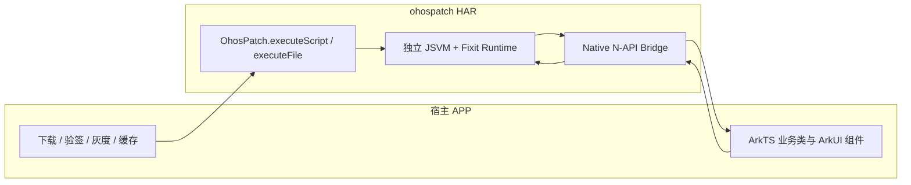
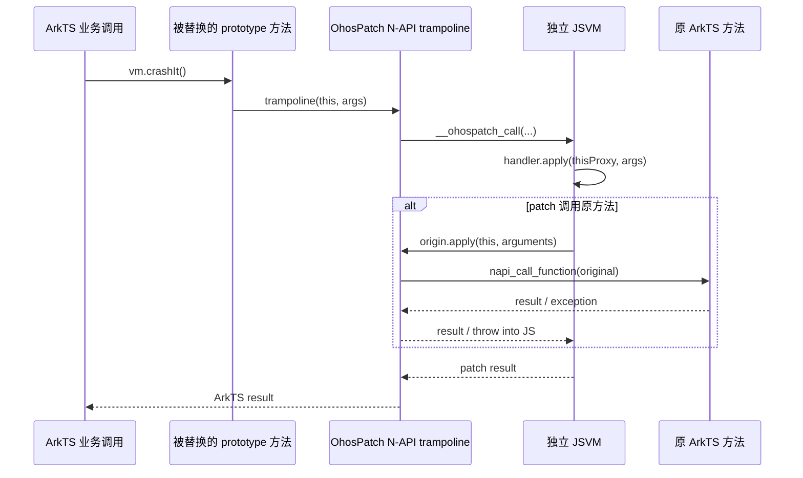
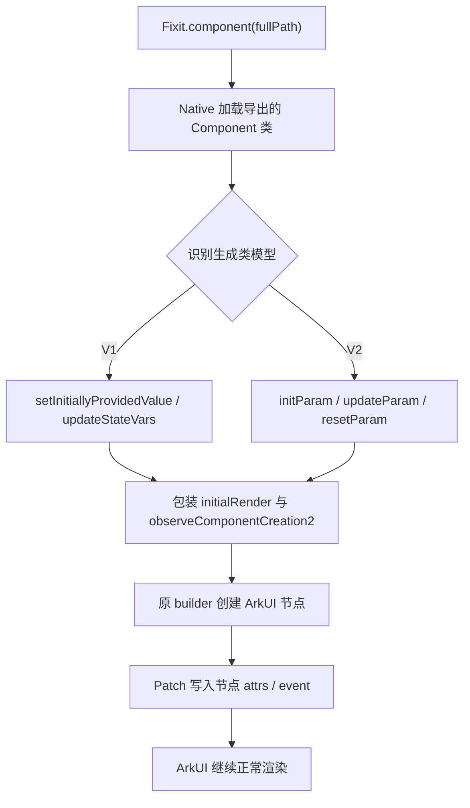
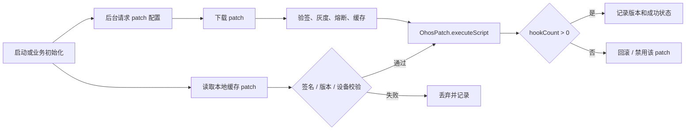

# OhosPatch

OhosPatch 是面向 HarmonyOS/OpenHarmony 的 ArkTS 运行时热修复框架，灵感来自 iOS 的 [FIXiT](https://github.com/rickytan/FIXiT)。它把补丁脚本放在独立 JSVM 中执行，再通过 Native N-API 在 ArkTS 主 VM 中加载目标模块、替换类原型方法和声明式组件渲染入口。

项目当前不是概念验证原型，而是一套可以按生产流程接入的 HAR 能力：宿主 APP 负责下载、验签、灰度、缓存和回滚，OhosPatch 只负责在运行时安装和清理 patch。业务类和业务组件不需要继承基类、加装饰器、注册类表或调用补丁分发 API。

## 背景

HarmonyOS 上的 ArkTS 应用发布后，常见问题包括：

- 线上业务方法抛异常，例如 `undefined is not a function`、数组越界、空值访问。
- 声明式组件参数、状态、属性或事件回调存在错误。
- 已发布版本需要小范围止血，但重新发版和审核周期过长。

在 iOS 上，FIXiT 可以依赖 JavaScriptCore 和 Objective-C runtime 动态替换方法。HarmonyOS 的情况不同：目前公开平台能力中没有一套面向 ArkTS 方法和 ArkUI 声明式组件的通用原生热修复方案，也没有类似 Objective-C runtime 的公开方法交换入口。OhosPatch 的目标是在不侵入业务代码的前提下，为 ArkTS 提供可控、可回滚、可观测的运行时 patch 能力。

## 能力概览

- 以 HAR 形式接入，产物是 `ohospatch.har`。
- Patch 使用普通 JavaScript 编写，在独立 JSVM 中运行。
- 支持实例方法、静态方法、原方法调用 `origin.apply(...)`。
- Patch handler 中的 `this` 是当前 ArkTS 实例 Proxy，支持点语法读写多层属性和调用方法。
- 支持 `Fixit.import(fullPath)` 动态导入其他 ArkTS 类，调用静态方法、构造实例、访问实例方法和属性。
- 支持声明式 Component DSL：参数、状态、节点属性和同步事件回调。
- 支持 `console` 到 HiLog、`setTimeout`、`setInterval`、`setImmediate`、`queueMicrotask`。
- C++ 层以 `-fno-exceptions` 构建，不抛 C++ 异常；错误走 HiLog 并 fail closed。
- `clear()` 可恢复原方法、清空 JS registry、释放引用并取消 timer。

## 工程结构

```text
OhosPatch/
├── ohospatch/                 # 可复用 HAR 模块，所有 patch 能力都在这里
│   ├── Index.ets              # HAR 对外 API
│   └── src/main/
│       ├── cpp/               # JSVM、N-API、Hook、ArkTS Proxy 桥
│       │   └── runtime/       # 内置 Fixit JS runtime
│       ├── ets/               # ArkTS 外观 API
│       └── module.json5       # 无下载、无验签、无启动任务
├── entry/                     # Demo APP，只负责演示宿主如何接入 HAR
│   └── src/main/ets/
│       ├── demo/              # 未侵入的业务类和组件
│       ├── patch/             # 宿主下载、验签接入点和加载策略
│       └── pages/             # 两级 Navigation Demo 页面
├── patch-server/              # 开发期 HTTP patch 服务
├── skills/ohospatch/          # Codex/Claude patch 编写 Skill
├── scripts/                   # 设备测试和 Skill 安装脚本
└── docs/images/               # README 效果图
```

`ohospatch` 不包含下载、签名验证、版本匹配、灰度、缓存或启动策略。这些都是宿主 APP 的生产发布系统职责。

## 架构



方法 Hook 调用链：



声明式组件 Hook 调用链：



## 原理

iOS FIXiT 同时依赖 JavaScriptCore 和 Objective-C runtime。HarmonyOS 上 `OH_JSVM_CreateVM` 创建的 JSVM 与 ArkTS 主 VM 不共享对象堆和原型链，因此在 JSVM 中直接改 `DemoViewModel.prototype` 不会影响 ArkTS 业务对象。

OhosPatch 使用两层运行时协作：

1. 宿主将已验证的完整 JavaScript 字符串或本地绝对路径传给 HAR。
2. Native 模块创建独立 JSVM，先执行内置 `fixit.js`，再执行宿主 patch。
3. Patch 通过 `Fixit.fix()`、`Fixit.component()` 和 `Fixit.import()` 注册目标。
4. Native 使用 `napi_load_module_with_info` 在 ArkTS 主 VM 加载业务模块。
5. 实例方法替换 `constructor.prototype[methodName]`，静态方法替换 `constructor[methodName]`。
6. 原方法以 `napi_ref` 保存，新方法进入 Native trampoline。
7. JSVM handler 中的 `this` 是调用期 Proxy；属性读取、赋值、方法调用同步桥接到原 ArkTS 对象。
8. `origin.apply(this, arguments)` 通过保存的 `napi_ref` 调回原方法。
9. `clear()` 恢复原函数并释放 Hook、Component、动态导入对象和 timer。

已创建的业务实例也会受影响，因为普通 public 方法调用会经过对象属性和原型查找。构造函数、私有实现、实例字段箭头函数和绕过属性查找的调用点不属于当前覆盖范围。

## 生产接入模型

OhosPatch 在生产环境中只负责“执行已可信 patch”。建议宿主侧按下面流程接入：



宿主必须负责：

- Patch 文件下载和 HTTPS 策略。
- 非对称签名或等价安全校验。
- App 版本、设备、系统版本、业务版本匹配。
- 灰度发布、黑白名单、熔断和回滚。
- Patch 缓存和清理。
- 启动时机、超时控制和日志上报。

HAR 不声明网络权限，也不会把任何下载或签名逻辑放入 `ohospatch` 模块。

## 接入方式

Demo 的 `entry/oh-package.json5` 使用本地 HAR 依赖：

```json5
{
  "dependencies": {
    "@rickytan/ohospatch": "file:../ohospatch"
  }
}
```

业务代码不需要任何改动。宿主只在自己的 patch 管理代码里调用：

```ts
import { OhosPatch } from '@rickytan/ohospatch';

const hookCount = OhosPatch.executeScript(verifiedPatchScript);
```

或者执行已下载到本地的完整文件路径：

```ts
const hookCount = OhosPatch.executeFile(absolutePatchPath);
```

`executeFile` 只读取绝对路径文件并执行；路径来源、文件权限、验签和缓存策略仍由宿主控制。

清除当前 patch：

```ts
OhosPatch.clear();
```

`executeScript` 返回已安装的普通方法 hook 数量。Component rule 主要在后续渲染阶段生效，生产侧不应只用 hook 数量判断业务效果，建议同时记录 patch 版本和运行时日志。

## Patch 编写

Patch 脚本可以引用声明文件获得 IDE 补全：

```js
/// <reference path="./fixit.d.js" />
```

完整目标路径格式是：

```text
bundleName/moduleName/modulePath#exportName
```

例如 Demo 的 `PatchablePanel` 导出自 `entry/src/main/ets/demo/PatchablePanel.ets`，所以目标为：

```text
com.rickytan.ohospatch/entry/src/main/ets/demo/PatchablePanel#PatchablePanel
```

下面每个示例都先列出已经发布在 APP 中、无需为 OhosPatch 修改的原始 ArkTS 代码，再列出下发的 JavaScript Patch。

### 修复实例方法

原始 ArkTS 类：

```ts
export class DemoViewModel {
  buttonTitle: string = 'idle';
  profile: DemoProfile = new DemoProfile();

  locationOf(locations: Array<Point>, index: number, _defaultValue: Point): Point {
    const point = locations[index];
    if (point === undefined) {
      throw new Error(`index ${index} out of bounds`);
    }
    return point;
  }
}
```

对应 Patch：

```js
var fix = Fixit.fix(
  'com.example.app/entry/src/main/ets/model/DemoViewModel#DemoViewModel'
);

var originLocation = fix.instanceMethod('locationOf', function (locations, index, fallback) {
  if (index < 0 || index >= locations.length) {
    this.profile.badge.text = 'out of bounds';
    this.profile.badge.advance(10);
    this.buttonTitle = this.profile.summary();
    return fallback;
  }
  return originLocation.apply(this, arguments);
});
```

`this` 是当前 `DemoViewModel` 实例的同步 Proxy，可以用普通点语法访问多层属性、赋值和调用实例方法。越界时 Patch 返回 `fallback`；未越界时，`originLocation.apply(this, arguments)` 把原接收者和全部原参数交还给原方法。

### 修复 `undefined is not a function`

原始 ArkTS 组件中的第三个 Button：

```ts
@Component
export struct PatchablePanel {
  @State statusText: string = 'Waiting for action';
  @State tagText: string = 'original tag';
  unsafeCallback?: () => string;

  build() {
    Column() {
      // occurrence 0: Primary action
      Button('Primary action').onClick(() => {})
      // occurrence 1: Secondary action
      Button('Secondary action').onClick(() => {})
      // occurrence 2: Unsafe onClick crash
      Button('Unsafe onClick crash')
        .onClick(() => {
          this.tagText = (this.unsafeCallback as () => string)();
        })
    }
  }
}
```

`unsafeCallback` 没有赋值，原 `Button.onClick` 会触发 `undefined is not a function`。对应 Patch 选择第三个 Button，替换其回调，并在 `try` 中调用原回调：

```js
var panel = Fixit.component(
  'com.example.app/entry/src/main/ets/components/PatchablePanel#PatchablePanel'
);

var originUnsafeClick = panel.node({ type: 'Button', occurrence: 2 })
  .event('onClick', function () {
    try {
      return originUnsafeClick.apply(this, arguments);
    } catch (err) {
      var message = err && err.message ? err.message : String(err);
      this.tagText = 'Recovered Button.onClick crash: ' + message;
      this.statusText = 'Patched Button.onClick recovered';
    }
  });
```

OhosPatch 在 `origin.apply(...)` 边界把原 ArkTS pending exception 转成当前 JSVM 调用中可捕获的 `Error`。这个 `try/catch` 必须包住 `originUnsafeClick.apply(...)`；只包 Patch 自己的状态赋值无法捕获原回调异常。handler 不处理异常时，Runtime fail closed，保留原业务异常行为。

### 修复静态方法并导入其他类

原始 ArkTS 类：

```ts
export class Point {
  readonly x: number;
  readonly y: number;

  constructor(x: number, y: number) {
    this.x = x;
    this.y = y;
  }

  toText(): string { return `(${this.x}, ${this.y})`; }
  static textOf(point: Point): string { return `(${point.x}, ${point.y})`; }
}

export class DemoViewModel {
  static crash(): string {
    throw new Error('class crash');
  }
}
```

对应 Patch：

```js
var Point = Fixit.import(
  'com.example.app/entry/src/main/ets/model/Point#Point'
);
var fix = Fixit.fix(
  'com.example.app/entry/src/main/ets/model/DemoViewModel#DemoViewModel'
);

fix.classMethod('crash', function () {
  var point = new Point(7, 9);
  return Point.textOf(point) + ' / ' + point.toText();
});
```

`Fixit.import()` 返回可调用的持久 ArkTS 类 Proxy，支持静态方法、`new`、实例属性和实例方法。`require(fullPath)` 只是它的兼容别名。

### 修复 Component 参数和状态

原始状态管理 V1 组件：

```ts
@Component
export struct PatchablePanel {
  @Prop message: string = 'Original component parameter';
  @Prop subtitle: string = 'Original subtitle';
  @State tapCount: number = 0;
  @State statusText: string = 'Waiting for action';

  build() {
    Column() {
      Text(this.message)
      Text(this.subtitle)
      Text(`tapCount=${this.tapCount}`)
      Text(`status=${this.statusText}`)
    }
  }
}
```

对应 Patch：

```js
var panel = Fixit.component(
  'com.example.app/entry/src/main/ets/components/PatchablePanel#PatchablePanel'
);

// 固定值替换。
panel.param('subtitle', 'Patched subtitle');
panel.state('statusText', 'Patched state');

// param 和 state 的函数形式都会接收替换前的值，并返回替换后的值。
panel.param('message', function (originValue) {
  this.statusText = 'Original message=' + originValue;
  return 'Patched component parameter';
});
panel.state('tapCount', function (originValue) {
  this.statusText = 'Original count=' + originValue;
  return originValue === 0 ? 40 : originValue;
});
```

`param(name, valueOrHandler)` 和 `state(name, valueOrHandler)` 使用相同形式。普通 `function` 中的 `this` 是当前 Component 实例 Proxy；箭头函数保留 JavaScript 词法 `this`，因此需要访问组件实例时不能使用箭头函数。旧的 `.param(name).replace/transform` 和 `.state(name).replace/transform` 链式写法不再支持。

状态管理 V2 使用相同 DSL：`param()` 对应 `@Param`，`state()` 可修复 `@Local` 等可观察实例状态。Runtime 根据编译产物自动选择 V1/V2 adapter，Patch 不需要声明版本。

### 选择节点并修复属性

原始组件开头按源码顺序创建以下四个 Text，后面还有 Toggle 标签和结果 Text：

```ts
@Component
export struct PatchablePanel {
  build() {
    Column() {
      Text(this.message)                                      // Text occurrence 0
      Text(this.subtitle)                                     // Text occurrence 1
      Text(`tapCount=${this.tapCount}`)                       // Text occurrence 2
        .fontColor('#27313D')
        .backgroundColor('#EEF2F5')
      Text(`status=${this.statusText}`)                       // Text occurrence 3
        .fontSize(14)
    }
  }
}
```

对应 Patch：

```js
// 字符串是 occurrence: 0 的简写，选择第一个 Text。
panel.node('Text').attr('fontColor', '#C44736');

// 选择第三个 Text，一次修复多个单参数属性。
panel.node({ type: 'Text', occurrence: 2 }).attrs({
  backgroundColor: '#E7F7EE',
  fontColor: function () {
    return this.tapCount > 45 ? '#C44736' : '#1F6B46';
  }
});

// 单个属性也可以使用动态 handler；每次目标节点渲染时重新求值。
panel.node({ type: 'Text', occurrence: 3 })
  .attr('fontSize', function () {
    return this.switchOn ? 16 : 14;
  });
```

Selector 目前只有字符串和 descriptor 两种输入形态：

| 写法 | 含义 |
| --- | --- |
| `node('Button')` | 当前目标组件渲染中的第一个 Button |
| `node({ type: 'Button' })` | 同上，`occurrence` 默认是 `0` |
| `node({ type: 'Button', occurrence: 2 })` | 当前目标组件渲染中的第三个 Button |

`type` 必须是内置 ArkUI 节点 API 名称，例如 `Text`、`Button`、`Toggle`、`Slider`。`occurrence` 从 `0` 开始，按同一类型节点在目标组件编译后渲染回调中的出现顺序单独计数；`Text occurrence: 2` 不受前面的 Button 或 Row 影响。节点规则在原 builder 执行后写入，因此 Patch 属性是最后写入者。

当前不支持 `id`、文本内容、父子层级、样式类或自定义 key selector。发布版本增删或调整同类型节点顺序后，`occurrence` 可能改变，因此宿主必须把 Patch 与准确 APP 版本绑定。

`attr(name, ...args)` 可传一个或多个 JSON 可序列化的静态参数；动态 handler 只能返回该属性的单个参数，不能附加额外参数。`attrs({...})` 是多个单参数 `attr` 的简写。

### 修复具有多个参数的事件

Demo 原始 Slider 事件有 `value` 和 `mode` 两个位置参数：

```ts
@Component
export struct PatchablePanel {
  @State sliderValue: number = 20;
  @State statusText: string = 'Waiting for action';

  build() {
    Slider({ value: this.sliderValue, min: 0, max: 100, step: 5 })
      .onChange((value: number, mode: SliderChangeMode) => {
        this.sliderValue = value;
        this.statusText = `Slider changed to ${value}, mode=${mode}`;
      })
  }
}
```

对应 Patch：

```js
var originSliderChange = panel.node({ type: 'Slider', occurrence: 0 })
  .event('onChange', function (value, mode) {
    this.tagText = 'Patched slider value=' + value + ', mode=' + mode;

    // arguments 同时包含 value 和 mode，按原顺序转发给 ArkTS 原回调。
    return originSliderChange.apply(this, arguments);
  });
```

`event(name, handler)` 会按原顺序把 ArkUI 回调的全部位置参数传给 handler，所以也可以显式写 `originSliderChange.call(this, value, mode)`。推荐 `origin.apply(this, arguments)`，这样原事件增加参数时不会遗漏。`event()` 返回的 origin Proxy 以及 Component `this` 只在当前同步事件调用中有效，不能保存到 timer、Promise 或全局变量后异步使用。

事件参数通过 JSON 快照跨越 ArkTS VM 与 JSVM；数字、字符串、布尔值、数组和普通 DTO 可直接使用。包含 Native 状态、循环引用、函数或 Controller 的事件对象不保证完整桥接，此类事件应只读取经过验证的可序列化字段。当前 event 是同步替换，不支持 `before`、`after`、`around` 或异步调用 origin。

## 内置 JS Runtime

`ohospatch/src/main/cpp/runtime/fixit.js` 会在构建 HAR 时嵌入 `libohospatch.so`。JSVM 创建后先执行内置 runtime，再执行宿主 patch。

内置 API：

- `Fixit.fix(fullPath)`
- `Fixit.component(fullPath)`
- `Fixit.import(fullPath)`
- `Fixit.registerTarget(className, descriptor)`
- `instanceMethod(name, handler)` / `classMethod(name, handler)`
- `component.param(name, valueOrHandler)` / `component.state(name, valueOrHandler)`
- `component.node(selector).attr(...)` / `.attrs(...)` / `.event(...)`
- `require(fullPath)`
- `nil` / `Nil`、`isNil`、`nilToNull`、`nullToNil`
- `console.debug/log/info/warn/error`
- `setTimeout` / `clearTimeout`
- `setInterval` / `clearInterval`
- `setImmediate` / `clearImmediate`
- `queueMicrotask(callback)`

`console.*` 会桥接到 HiLog 的 `OhosPatch` tag。

## IDE 和 AI Patch 编写

声明文件位于：

```text
skills/ohospatch/references/fixit.d.js
```

它只用于开发期语言服务，不需要下发到设备。其 `@version` 必须与 `Fixit.runtimeVersion` 保持一致。

仓库内置 `ohospatch` Skill，方便 Codex 和 Claude Code 按当前 runtime 约束生成 patch：

```bash
./scripts/install-skill.sh
```

安装后：

- Codex 中使用 `$ohospatch`
- Claude Code 中使用 `/ohospatch`

## Demo 效果

Demo APP 是两级 Navigation：

1. 第一屏：`Load patch`、`Clear patch`、进入 patch target screen。
2. 第二屏：展示 Component 参数/状态/属性/事件、普通方法 hook、静态方法 hook、`Fixit.import()`、timer，以及一个会触发 `undefined is not a function` 的按钮。

Patch 前：


Patch 后：


### Demo Patch 为什么这样写

Demo 使用一个真实的远程脚本 [`entry/src/main/resources/rawfile/patch.js`](entry/src/main/resources/rawfile/patch.js) 同时覆盖 Runtime 的主要能力，而不是为截图写一份特殊 Patch。它对应的未侵入业务源码是 [`PatchablePanel.ets`](entry/src/main/ets/demo/PatchablePanel.ets)、[`PatchablePanelV2.ets`](entry/src/main/ets/demo/PatchablePanelV2.ets)、[`DemoViewModel.ets`](entry/src/main/ets/demo/DemoViewModel.ets) 和 [`Point.ets`](entry/src/main/ets/demo/Point.ets)。

脚本按以下目的组织：

1. `param/state` 同时演示固定值和基于原值的函数替换，以及 handler 中的 Component `this`。
2. 多个 `Text/Button/Toggle/Slider` 规则验证 selector 的按类型 `occurrence` 计数、静态属性、动态属性和多参数事件。
3. Button handler 分别演示“先执行 Patch 再调 origin”“Patch 调组件方法后再调 origin”和“用 try/catch 包住会抛错的 origin”。
4. V1 与 V2 使用同一 DSL，验证 Runtime 自动选择 adapter。
5. `DemoViewModel`、`Point` 和 timer 规则验证普通方法、静态方法、跨模块 import、嵌套 Proxy 与 JSVM 全局函数。

截图中的可见变化与 Patch 一一对应：

| Patch 规则 | Patch 前 | Patch 后截图中的效果 |
| --- | --- | --- |
| `param('message', ...)` | `Original component parameter` | 顶部标题内容变为 `Patched component parameter` |
| `param('subtitle', handler)` | `State, attrs, events...` | 副标题变为 `Patched subtitle from remote JavaScript` |
| 第一个 Text 的 `fontColor` | 标题为深色 | 标题变为红色 |
| `state('tapCount', handler)` | `tapCount=0` | `tapCount=40` |
| `state('secondaryCount', handler)` | `secondary=1` | `secondary=21` |
| 第三个 Text 的 `backgroundColor/fontColor` | 灰底深色文字 | `tapCount` 行变为浅绿底绿色文字 |
| `state('switchOn', true)` | Switch 关闭 | Switch 打开并显示 `Switch is on` |
| `state('sliderValue', 75)` | Slider 值为 20 | Slider 滑块位于 75 |
| 三个 Button 的 `height/backgroundColor` | 高 44，灰/棕/红 | 高 52，红/绿/绿 |
| 第三个 Button 的 `onClick` | 点击调用 undefined callback | 截图是在点击后拍摄：页面存活，`status` 和 `tag` 显示 recovered 信息 |
| `locationOf` 实例方法 | `Invalid index -> index 2 out of bounds` | 返回 fallback `(0.5, 1.5)`，并通过嵌套 Proxy 写出 `out of bounds@10` |

截图首屏范围没有显示 V2 面板以及后续 method/import/timer 结果；向下滚动可以继续验证。拖动 Slider 时，Patch handler 会收到 `value`、`mode` 两个参数，写入 `tagText` 后通过 `originSliderChange.apply(this, arguments)` 保留原来的 Slider 状态更新。点击 Primary/Secondary Button 则会看到 Patch 对组件方法和原事件回调的组合调用。

启动本地 patch 服务：

```bash
node patch-server/server.mjs
```

设备或模拟器通过 HDC 反向连接本机服务：

```bash
hdc rport tcp:8080 tcp:8080
```

验证流程：

1. 安装并启动 Demo。
2. 进入第二屏，观察原始组件参数、状态和按钮样式。
3. 未加载 patch 时点击 `Unsafe onClick crash`，会触发未定义函数调用错误。
4. 返回第一屏，点击 `Load patch`。
5. 再进入第二屏，观察参数、状态、Text/Button 属性、Button/Toggle 回调均被 patch 影响。
6. 点击 `Unsafe onClick crash`，页面不会崩溃，`tag=` 文本显示 `Recovered Button.onClick crash: ...`。
7. 等待 100 ms 后点击 `Run method hook scenario`，结果中应包含 `timer=fired`，HiLog 中会出现 `OhosPatch setTimeout callback fired`。
8. 点击 `Clear patch` 后重新进入第二屏，恢复原始行为。

## 构建

构建独立 HAR：

```bash
/Applications/DevEco-Studio.app/Contents/tools/hvigor/bin/hvigorw \
  --mode module -p module=ohospatch assembleHar --no-daemon
```

产物：

```text
ohospatch/build/default/outputs/default/ohospatch.har
```

构建 Demo HAP：

```bash
/Applications/DevEco-Studio.app/Contents/tools/hvigor/bin/hvigorw \
  --mode module -p module=entry assembleHap --no-daemon
```

运行真实设备/模拟器测试：

```bash
npm test
```

`npm test` 会构建 Demo HAP 和 `entry@ohosTest` HAP，安装到已连接设备并通过鸿蒙自带测试框架执行行为测试。

## GitHub Actions

`.github/workflows/harmonyos-build.yml`：

- 手动运行或 `main` 分支 push 且 `HARMONYOS_CI_ENABLED=true` 时，在自托管 macOS ARM64 runner 上构建 HAR 和未签名 HAP。
- 使用 GitHub Environment `ohpm` 读取环境级变量。
- 上传未签名 HAR/HAP artifact。
- 检查 `libohospatch.so` 是否含 C++ exception 相关符号。

`.github/workflows/ohpm-publish.yml`：

- tag `v*` 触发。
- 校验 tag 与 `ohospatch/oh-package.json5` 版本一致。
- 使用 GitHub Environment `ohpm` 中的发布凭证和 registry 配置。
- 构建 HAR 并执行 `ohpm publish`。

自托管 runner 需要标签：

```text
self-hosted, macOS, ARM64, harmonyos
```

默认工具路径：

```text
/Applications/DevEco-Studio.app/Contents
$HOME/Library/OpenHarmony/Sdk
```

路径不同时，通过环境或仓库变量 `DEVECO_STUDIO_HOME`、`OHOS_BASE_SDK_HOME` 覆盖。

## 当前边界

- prototype hook 不覆盖构造函数、实例字段箭头函数、私有实现或不经过属性查找的调用点。
- Patch handler 的 `this` Proxy 只在当前同步调用或 `origin` 调用期间有效，不应保存到 timer、Promise 或全局变量后异步访问。
- `Fixit.import()` 返回的持久 Proxy 可保留到 `OhosPatch.clear()` 或下一次 patch 替换。
- 普通方法参数和新建 JS 对象仍受 JSON wire 类型限制。
- Component DSL 当前支持 API 20 状态管理 V1/V2、导出的自定义组件、`type + occurrence` 节点选择器、JSON 属性参数和同步事件替换。
- 非导出的 `@Entry` 页面、层级/ID 选择器、资源与控制器类型、已挂载组件主动刷新，以及 `before/after/around` 事件组合尚未支持。
- 单个 runtime 最多同时存在 256 个 timer。
- 单个 patch 最多保留 512 个去重后的动态导入类、实例、方法或嵌套对象句柄。

## 安全和稳定性

- 生产宿主必须在调用 HAR 前完成签名校验、版本匹配、灰度、缓存、回滚、超时和熔断。
- C++ 层不抛异常；JSVM/N-API 错误会记录 error 级 HiLog 并 fail closed。
- Patch 安装失败会回滚已安装 hook。
- Patch handler 失败时会回退原 ArkTS 方法或返回安全结果，具体取决于 hook 类型。
- `clear()` 会恢复原方法并释放 patch 生命周期内的引用。
