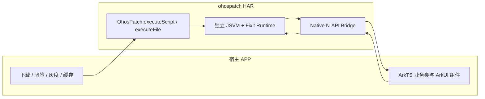
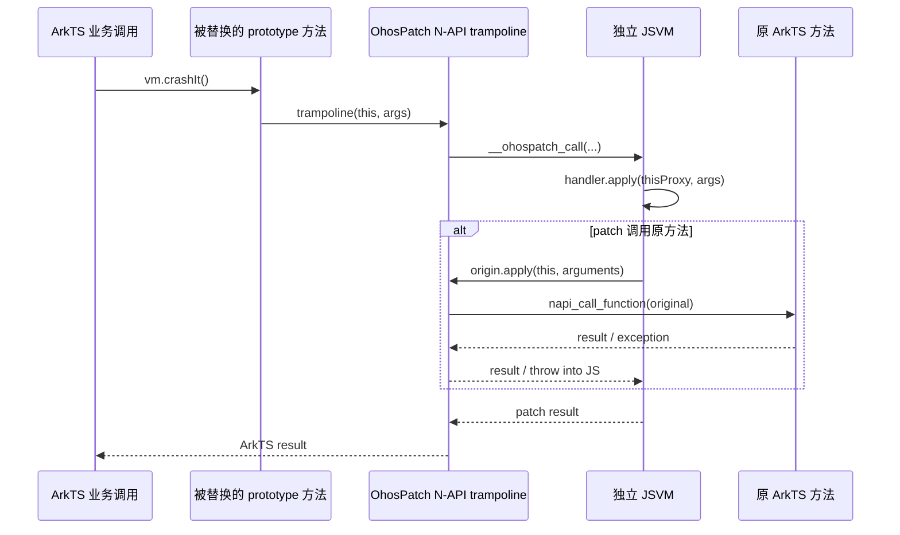
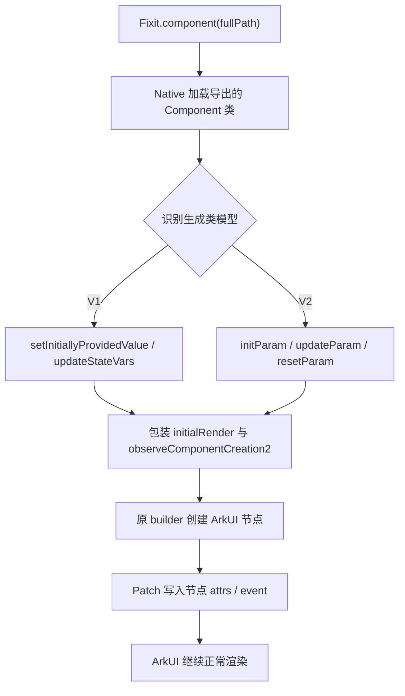
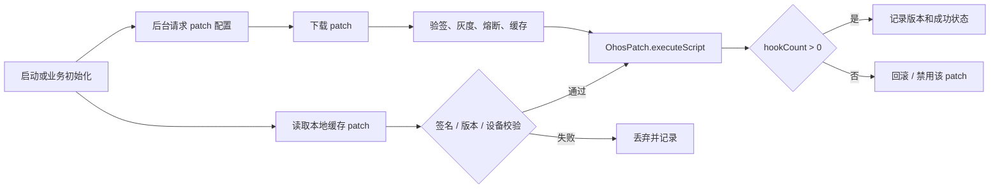

# OhosPatch

OhosPatch 是面向 HarmonyOS/OpenHarmony 的 ArkTS 运行时热修复框架，灵感来自 iOS 的 [FIXiT](https://github.com/rickytan/FIXiT)。它把补丁脚本放在独立 JSVM 中执行，再通过 Native N-API 在 ArkTS 主 VM 中加载目标模块、替换类原型方法和声明式组件渲染入口。

项目当前不是概念验证原型，而是一套可以按生产流程接入的 HAR 能力：宿主 APP 负责下载、验签、灰度、缓存和回滚，OhosPatch 只负责在运行时安装和清理 patch。业务类和业务组件不需要继承基类、加装饰器、注册类表或调用补丁分发 API。

## 背景

HarmonyOS 上的 ArkTS 应用发布后，常见问题包括：

- 线上业务方法抛异常，例如 `undefined is not a function`、数组越界、空值访问。
- 声明式组件参数、状态、属性或事件回调存在错误。
- 已发布版本需要小范围止血，但重新发版和审核周期过长。

在 iOS 上，FIXiT 可以依赖 JavaScriptCore 和 Objective-C runtime 动态替换方法。HarmonyOS 的情况不同：目前公开平台能力中没有一套面向 ArkTS 方法和 ArkUI 声明式组件的通用原生热修复方案，也没有类似 Objective-C runtime 的公开方法交换入口。OhosPatch 的目标是在不侵入业务代码的前提下，为 ArkTS 提供可控、可回滚、可观测的运行时 patch 能力。

## 能力概览

- 以 HAR 形式接入，产物是 `ohospatch.har`。
- Patch 使用普通 JavaScript 编写，在独立 JSVM 中运行。
- 支持实例方法、静态方法、原方法调用 `origin.apply(...)`。
- Patch handler 中的 `this` 是当前 ArkTS 实例 Proxy，支持点语法读写多层属性和调用方法。
- 支持 `Fixit.import(fullPath)` 动态导入其他 ArkTS 类，调用静态方法、构造实例、访问实例方法和属性。
- 支持声明式 Component DSL：参数、状态、节点属性和同步事件回调。
- 支持 `console` 到 HiLog、`setTimeout`、`setInterval`、`setImmediate`、`queueMicrotask`。
- C++ 层以 `-fno-exceptions` 构建，不抛 C++ 异常；错误走 HiLog 并 fail closed。
- `clear()` 可恢复原方法、清空 JS registry、释放引用并取消 timer。

## 工程结构

```text
OhosPatch/
├── ohospatch/                 # 可复用 HAR 模块，所有 patch 能力都在这里
│   ├── Index.ets              # HAR 对外 API
│   └── src/main/
│       ├── cpp/               # JSVM、N-API、Hook、ArkTS Proxy 桥
│       │   └── runtime/       # 内置 Fixit JS runtime
│       ├── ets/               # ArkTS 外观 API
│       └── module.json5       # 无下载、无验签、无启动任务
├── entry/                     # Demo APP，只负责演示宿主如何接入 HAR
│   └── src/main/ets/
│       ├── demo/              # 未侵入的业务类和组件
│       ├── patch/             # 宿主下载、验签接入点和加载策略
│       └── pages/             # 两级 Navigation Demo 页面
├── patch-server/              # 开发期 HTTP patch 服务
├── skills/ohospatch/          # Codex/Claude patch 编写 Skill
├── scripts/                   # 设备测试和 Skill 安装脚本
└── docs/images/               # README 效果图
```

`ohospatch` 不包含下载、签名验证、版本匹配、灰度、缓存或启动策略。这些都是宿主 APP 的生产发布系统职责。

## 架构



方法 Hook 调用链：



声明式组件 Hook 调用链：



## 原理

iOS FIXiT 同时依赖 JavaScriptCore 和 Objective-C runtime。HarmonyOS 上 `OH_JSVM_CreateVM` 创建的 JSVM 与 ArkTS 主 VM 不共享对象堆和原型链，因此在 JSVM 中直接改 `DemoViewModel.prototype` 不会影响 ArkTS 业务对象。

OhosPatch 使用两层运行时协作：

1. 宿主将已验证的完整 JavaScript 字符串或本地绝对路径传给 HAR。
2. Native 模块创建独立 JSVM，先执行内置 `fixit.js`，再执行宿主 patch。
3. Patch 通过 `Fixit.fix()`、`Fixit.component()` 和 `Fixit.import()` 注册目标。
4. Native 使用 `napi_load_module_with_info` 在 ArkTS 主 VM 加载业务模块。
5. 实例方法替换 `constructor.prototype[methodName]`，静态方法替换 `constructor[methodName]`。
6. 原方法以 `napi_ref` 保存，新方法进入 Native trampoline。
7. JSVM handler 中的 `this` 是调用期 Proxy；属性读取、赋值、方法调用同步桥接到原 ArkTS 对象。
8. `origin.apply(this, arguments)` 通过保存的 `napi_ref` 调回原方法。
9. `clear()` 恢复原函数并释放 Hook、Component、动态导入对象和 timer。

已创建的业务实例也会受影响，因为普通 public 方法调用会经过对象属性和原型查找。构造函数、私有实现、实例字段箭头函数和绕过属性查找的调用点不属于当前覆盖范围。

## 生产接入模型

OhosPatch 在生产环境中只负责“执行已可信 patch”。建议宿主侧按下面流程接入：



宿主必须负责：

- Patch 文件下载和 HTTPS 策略。
- 非对称签名或等价安全校验。
- App 版本、设备、系统版本、业务版本匹配。
- 灰度发布、黑白名单、熔断和回滚。
- Patch 缓存和清理。
- 启动时机、超时控制和日志上报。

HAR 不声明网络权限，也不会把任何下载或签名逻辑放入 `ohospatch` 模块。

## 接入方式

Demo 的 `entry/oh-package.json5` 使用本地 HAR 依赖：

```json5
{
  "dependencies": {
    "@rickytan/ohospatch": "file:../ohospatch"
  }
}
```

业务代码不需要任何改动。宿主只在自己的 patch 管理代码里调用：

```ts
import { OhosPatch } from '@rickytan/ohospatch';

const hookCount = OhosPatch.executeScript(verifiedPatchScript);
```

或者执行已下载到本地的完整文件路径：

```ts
const hookCount = OhosPatch.executeFile(absolutePatchPath);
```

`executeFile` 只读取绝对路径文件并执行；路径来源、文件权限、验签和缓存策略仍由宿主控制。

清除当前 patch：

```ts
OhosPatch.clear();
```

`executeScript` 返回已安装的普通方法 hook 数量。Component rule 主要在后续渲染阶段生效，生产侧不应只用 hook 数量判断业务效果，建议同时记录 patch 版本和运行时日志。

## Patch 编写

Patch 脚本可以引用声明文件获得 IDE 补全：

```js
/// <reference path="./fixit.d.js" />
```

### 修复实例方法

```js
var fix = Fixit.fix(
  'com.example.app/entry/src/main/ets/model/DemoViewModel#DemoViewModel'
);

var origin = fix.instanceMethod('locationOf', function (locations, index, fallback) {
  if (index < 0 || index >= locations.length) {
    this.profile.badge.text = 'out of bounds';
    this.profile.badge.advance(10);
    return fallback;
  }
  return origin.apply(this, arguments);
});
```

### 修复 `undefined is not a function`

Demo 中第二屏的 `Unsafe onClick crash` 是一个普通 ArkUI `Button().onClick` 回调。未加载 patch 时点击会在 onClick 内直接调用未定义 callback，并触发 `undefined is not a function` 类错误；加载 patch 后，OhosPatch 用 Component event DSL 替换这个 Button 的 `onClick`，在回调最外层加 `try/catch`，并在 `try` 中调用原始事件回调。这样 patch 的性质和实例方法修复一致：包住原方法，捕获原始实现中的异常，再写回组件状态：

```js
var originUnsafeClick = panel.node({ type: 'Button', occurrence: 2 })
  .event('onClick', function () {
    try {
      return originUnsafeClick.apply(this, arguments);
    } catch (err) {
      var message = err && err.message ? err.message : String(err);
      this.tagText = 'Recovered Button.onClick crash: ' + message;
      this.statusText = 'Patched Button.onClick recovered';
    }
  });
```

注意：OhosPatch 只会在 patch 显式调用 `origin.apply(this, arguments)` 时，把原 ArkTS pending exception 转成 JSVM 中可捕获的 `Error`。如果 handler 没有 catch，调用会回退到原 ArkTS 实现并继续保留原始异常行为。

### 修复静态方法并导入其他类

```js
var Point = Fixit.import(
  'com.example.app/entry/src/main/ets/model/Point#Point'
);

fix.classMethod('crash', function () {
  var point = new Point(7, 9);
  return Point.textOf(point) + ' / ' + point.toText();
});
```

`require(fullPath)` 是 `Fixit.import(fullPath)` 的兼容别名。

### 修复声明式组件

```js
var panel = Fixit.component(
  'com.example.app/entry/src/main/ets/components/PatchablePanel#PatchablePanel'
);

panel.param('message').replace('Patched component parameter');
panel.state('statusText', 'Patched state');
panel.state('tapCount', function (originValue) {
  this.statusText = 'Original count=' + originValue;
  return originValue === 0 ? 40 : originValue;
});

var originClick = panel.node({ type: 'Button', occurrence: 0 })
  .attrs({ height: 52, backgroundColor: '#C44736' })
  .event('onClick', function () {
    this.tagText = 'tapCount=' + this.tapCount;
    this.markPrimary(10);
    return originClick.apply(this, arguments);
  });
```

Component DSL 当前支持 API 20 状态管理 V1 与 V2 导出的自定义组件，两者使用完全相同的 DSL。V2 中 `param()` 对应 `@Param`，`state(name, valueOrHandler)` 可修复 `@Local` 等可观察实例状态；函数形式接收原状态值，普通 `function` 的 `this` 指向当前 Component 实例 Proxy。Runtime 会根据编译产物自动选择 adapter，patch 脚本不需要声明组件版本。

`event(name, handler)` 是同步事件替换；handler 只接收 ArkUI 原始事件参数，普通 `function` 的 `this` 指向当前 Component 实例 Proxy。

## 内置 JS Runtime

`ohospatch/src/main/cpp/runtime/fixit.js` 会在构建 HAR 时嵌入 `libohospatch.so`。JSVM 创建后先执行内置 runtime，再执行宿主 patch。

内置 API：

- `Fixit.fix(fullPath)`
- `Fixit.component(fullPath)`
- `Fixit.import(fullPath)`
- `Fixit.registerTarget(className, descriptor)`
- `instanceMethod(name, handler)` / `classMethod(name, handler)`
- `component.param(name)` / `component.state(name, valueOrHandler)`
- `component.node(selector).attr(...)` / `.attrs(...)` / `.event(...)`
- `require(fullPath)`
- `nil` / `Nil`、`isNil`、`nilToNull`、`nullToNil`
- `console.debug/log/info/warn/error`
- `setTimeout` / `clearTimeout`
- `setInterval` / `clearInterval`
- `setImmediate` / `clearImmediate`
- `queueMicrotask(callback)`

`console.*` 会桥接到 HiLog 的 `OhosPatch` tag。

## IDE 和 AI Patch 编写

声明文件位于：

```text
skills/ohospatch/references/fixit.d.js
```

它只用于开发期语言服务，不需要下发到设备。其 `@version` 必须与 `Fixit.runtimeVersion` 保持一致。

仓库内置 `ohospatch` Skill，方便 Codex 和 Claude Code 按当前 runtime 约束生成 patch：

```bash
./scripts/install-skill.sh
```

安装后：

- Codex 中使用 `$ohospatch`
- Claude Code 中使用 `/ohospatch`

## Demo 效果

Demo APP 是两级 Navigation：

1. 第一屏：`Load patch`、`Clear patch`、进入 patch target screen。
2. 第二屏：展示 Component 参数/状态/属性/事件、普通方法 hook、静态方法 hook、`Fixit.import()`、timer，以及一个会触发 `undefined is not a function` 的按钮。

Patch 前：


Patch 后：


启动本地 patch 服务：

```bash
node patch-server/server.mjs
```

设备或模拟器通过 HDC 反向连接本机服务：

```bash
hdc rport tcp:8080 tcp:8080
```

验证流程：

1. 安装并启动 Demo。
2. 进入第二屏，观察原始组件参数、状态和按钮样式。
3. 未加载 patch 时点击 `Unsafe onClick crash`，会触发未定义函数调用错误。
4. 返回第一屏，点击 `Load patch`。
5. 再进入第二屏，观察参数、状态、Text/Button 属性、Button/Toggle 回调均被 patch 影响。
6. 点击 `Unsafe onClick crash`，页面不会崩溃，`tag=` 文本显示 `Recovered Button.onClick crash: ...`。
7. 等待 100 ms 后点击 `Run method hook scenario`，结果中应包含 `timer=fired`，HiLog 中会出现 `OhosPatch setTimeout callback fired`。
8. 点击 `Clear patch` 后重新进入第二屏，恢复原始行为。

## 构建

构建独立 HAR：

```bash
/Applications/DevEco-Studio.app/Contents/tools/hvigor/bin/hvigorw \
  --mode module -p module=ohospatch assembleHar --no-daemon
```

产物：

```text
ohospatch/build/default/outputs/default/ohospatch.har
```

构建 Demo HAP：

```bash
/Applications/DevEco-Studio.app/Contents/tools/hvigor/bin/hvigorw \
  --mode module -p module=entry assembleHap --no-daemon
```

运行真实设备/模拟器测试：

```bash
npm test
```

`npm test` 会构建 Demo HAP 和 `entry@ohosTest` HAP，安装到已连接设备并通过鸿蒙自带测试框架执行行为测试。

## GitHub Actions

`.github/workflows/harmonyos-build.yml`：

- 手动运行或 `main` 分支 push 且 `HARMONYOS_CI_ENABLED=true` 时，在自托管 macOS ARM64 runner 上构建 HAR 和未签名 HAP。
- 使用 GitHub Environment `ohpm` 读取环境级变量。
- 上传未签名 HAR/HAP artifact。
- 检查 `libohospatch.so` 是否含 C++ exception 相关符号。

`.github/workflows/ohpm-publish.yml`：

- tag `v*` 触发。
- 校验 tag 与 `ohospatch/oh-package.json5` 版本一致。
- 使用 GitHub Environment `ohpm` 中的发布凭证和 registry 配置。
- 构建 HAR 并执行 `ohpm publish`。

自托管 runner 需要标签：

```text
self-hosted, macOS, ARM64, harmonyos
```

默认工具路径：

```text
/Applications/DevEco-Studio.app/Contents
$HOME/Library/OpenHarmony/Sdk
```

路径不同时，通过环境或仓库变量 `DEVECO_STUDIO_HOME`、`OHOS_BASE_SDK_HOME` 覆盖。

## 当前边界

- prototype hook 不覆盖构造函数、实例字段箭头函数、私有实现或不经过属性查找的调用点。
- Patch handler 的 `this` Proxy 只在当前同步调用或 `origin` 调用期间有效，不应保存到 timer、Promise 或全局变量后异步访问。
- `Fixit.import()` 返回的持久 Proxy 可保留到 `OhosPatch.clear()` 或下一次 patch 替换。
- 普通方法参数和新建 JS 对象仍受 JSON wire 类型限制。
- Component DSL 当前支持 API 20 状态管理 V1/V2、导出的自定义组件、`type + occurrence` 节点选择器、JSON 属性参数和同步事件替换。
- 非导出的 `@Entry` 页面、层级/ID 选择器、资源与控制器类型、已挂载组件主动刷新，以及 `before/after/around` 事件组合尚未支持。
- 单个 runtime 最多同时存在 256 个 timer。
- 单个 patch 最多保留 512 个去重后的动态导入类、实例、方法或嵌套对象句柄。

## 安全和稳定性

- 生产宿主必须在调用 HAR 前完成签名校验、版本匹配、灰度、缓存、回滚、超时和熔断。
- C++ 层不抛异常；JSVM/N-API 错误会记录 error 级 HiLog 并 fail closed。
- Patch 安装失败会回滚已安装 hook。
- Patch handler 失败时会回退原 ArkTS 方法或返回安全结果，具体取决于 hook 类型。
- `clear()` 会恢复原方法并释放 patch 生命周期内的引用。
